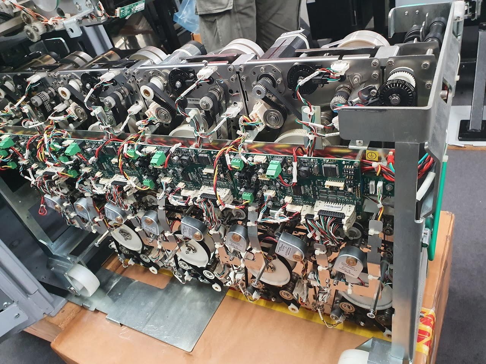
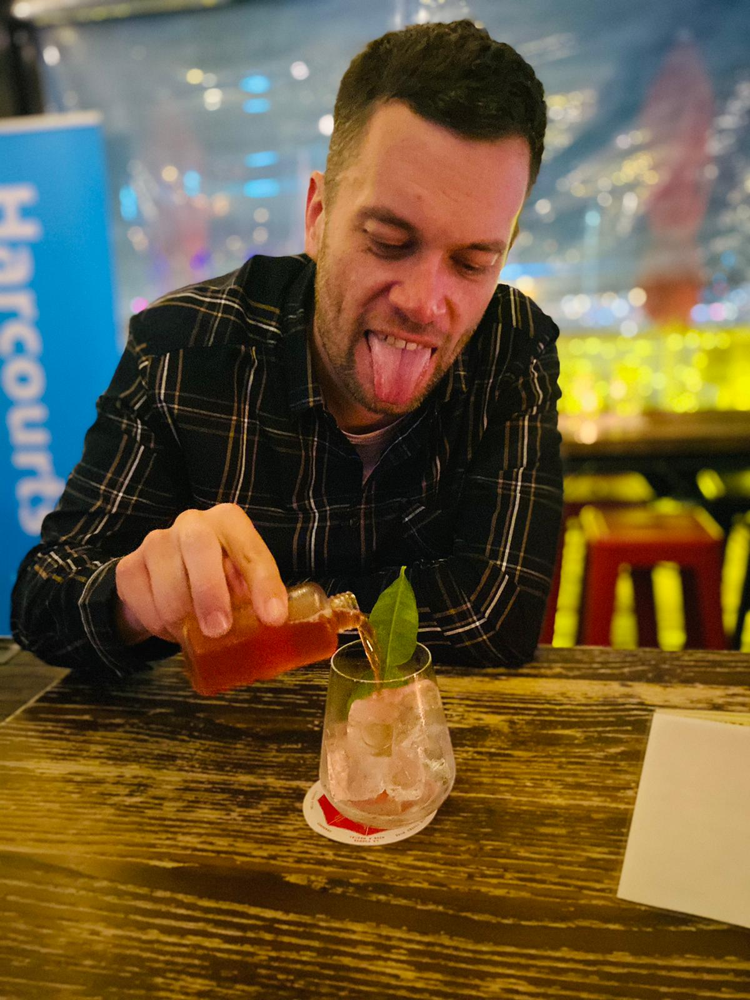

Well, training here is going well! It's intimidating to understand a big and complicated machine, but the boss man Karl ensures us it's not as bad as it looks. It's all sensors and belts and mechanicalness.

_Does anyone really know what all that is?!._

I got frustrating news too. I had high hopes of getting a company vehicle provided to me, and I could take it back with me from Auckland while I'm up here. Currently I'm using an old Mazda 2 with the back seat taken out. It's…. Dying, and extremely frustrating to use for work. I just got the news that, despite my boss being optimistic, they can't provide me with a vehicle right now. I'm tempted to buy something myself! But then they'll probably force a company car on me a few months after I've shelled out for some kind of SUV.

I had a night out on Tuesday. I think it might be the first one… ever? It was in the city and I was actually drinking rather than being the sober driver.

It was good to hang out with a colleague, that was really nice! But holy crap, I should get my phone taken off me when I'm a bit sloshed.

I ended up getting locked out of my hotel room, and I had people phoning me worrying about what I was doing when I wasn't answering my phone. I left messages with… someone that made them be very concerned about me.

_All fun and games to start with._

I'm sorry! I didn't mean to cause distress. That's for caring about me. Also, thank your mum for caring about me too.

The whole day after I felt…. Sunburned. Is that odd? First hangover in 15 years, what an odd feeling.

If you've followed my ravings over the last few weeks you'll see things like affection, trust, love and loyalty being these huge building blocks of relationships. I can give all I've got in these areas, and I've discovered just how amazing of a feeling that is. Doing loving things for someone I love is better than I ever imagined.

But hell, I missed a big one. I'm so boring. Given the things I do for fun, I doubt anyone would tolerate me being the #1 person in their life for an extended period.

I got told by someone that all this emotional distress I've been over recently had driven me to be a person I'm totally not.

Maybe that's a good thing. I need to be more fun and interesting, even if that pushes me way out of my comfort zone and makes me do things I just don't like to do. I mean, I don't want to just be… happy and content with who I am. That's not working! If I want to be around people I need to suck it up and do what they do - what all the kids say are fun! I just hope I don't become down and depressed, or arrogant and an asshole. But maybe that could even be better for me?

I'll leave my phone at home.

My head hurts. I miss my former girlfriend so much.

Everyone tells me I should move on. My friend Mark says he'd lock me in his basement if I ever got back with her! A colleague here I shared my story of heartbreak with said I can do better, but I think she was just being nice. Just this morning boss man Karl asked if I was married yet. Owch, that hurt. Last time I was up here in November I wouldn't shut up about my amazing girlfriend and our huge plans, now I only bring it up when drunk and stupid.

I love her, but I really shouldn’t - for her benefit and mine. Right now I'd saw my leg off to be back with her, but that'd be fruitless as it's more and more clear every day that she just isn't interested at all. And that kills me a tiny bit.

https://www.youtube.com/watch?v=/nZXRV4MezEw

But hey, anyone have great advice for moving on? Other than drink. That didn't work out so well for me.
