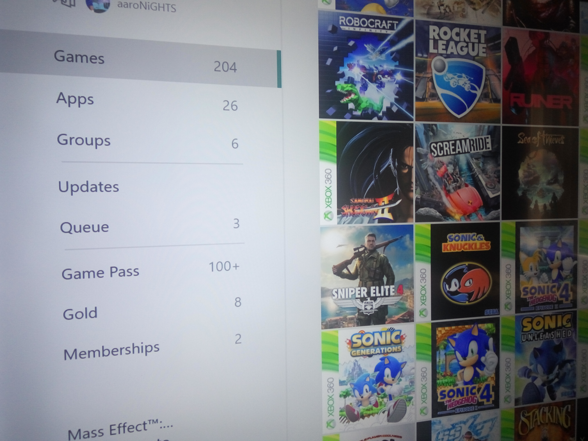

### 2018 hasn't been a very... progressive year.

After moving back from the city at the end of last year, my responsibilities and life have become rather static. I get told I do an important job and do it well, but I still feel sharply pathetic revealing what I do. Saying to someone that I look after an elderly man in a small, dead town isn't very attractive. <!-- more -->

_Hey! It was overcast and windy._

But like I said before, [I get by with a little help from my friends.](/blog/2018/12/02/a-little-help-from-my-friends) Having a circle of friends has become important to me. Crazy, I know! I manage to organize things so I seem to get away every other weekend, doing things from LAN-ing up for some vintage Halp to going to a pub.

I'm still extremely awkward, but dating is more fun than hard. It's still not an overly frequent event, though. I have pity for [the version of me from years ago when that first “personal” entry was posted.](/blog/2017/04/11/dating-is-hard-and-i-am-very-awkward) I don't get nervous for most things in life now, plus I've learned the fine art of shutting the hell up and listening rather than raving on.

Some of the time at least.

I am gaming much more. I picked up an Xbox One and opted to go all digital with games. Right now it's showing 204 games installed, that many physical discs would require a small shed! I'm not sure of the legitimacy of the various key trading websites I've been using to buy stuff, but I like to live dangerously. I'm also using the Game Pass subscription service Microsoft offers. Picking up 6 month extensions as they've come on sale has got me all loaded up until sometime late 2020. Remember when that felt like an unobtainable future?

_The big number is daunting._

A few highlights from the experience are:

* [Snake Pass:](http://www.snake-pass.com/) Very frustrating until you figure out how to actually progress, but it's such a beautiful game with a neat approach to traversal.
* [Sniper Elite 4:](https://sniperelite4.com/en) Yes, it's absolutely absurd. But it's fun! Any bugs or annoying quirks from prior installments in the series have been ironed out. Testicle shots always cause me to wince.
* [Sonic Forces:](https://www.sega.com/games/sonic-forces) An attempt to return to the tried and true method, after not being successful for a bit. It is the same Sonic Colours/Sonic Generations gameplay, oddly limited in scope despite attempts to put new features in like character creation. Not amazing, but I was still left wanting more. Maybe even [One More Last First Bump.](https://www.youtube.com/watch?v=9gc0169Ht48)
* [Halo 5: Guardians:](https://www.microsoft.com/en-us/p/halo-5-guardians/brrc2bp0g9p0?activetab=pivot:overviewtab) Extremely strong mechanics, tuned almost too well.. The story got a bit… bogged down. The removal of split screen was unfortunate, largely because none of my friends are at all interested in an Xbox One. Would love to do a 4 player team to push through on Legendary difficulty, but alas.
* [Forza Horizon 4:](https://forzamotorsport.net/en-us/games/fh4) I was impressed by realising how much tech must be under the hood in order to have all these different vehicles handle so well in so many different environments. Racing isn't a high priority, my biggest time sink is blindly exploring this little bit of fictional Britain.

I still have things to get to! I really want to dive into Paper Mario: Color Splash on Wii U - having that and others in my backlog is somewhat holding me back from investing in a Switch.

Sometime in the New Year, when the postal service starts to run again, I should have another budget review up. This time it's for what I'd call the cheapest viable phone. It's from a brand I've never heard of, but on paper it looks like a deal. I think I'm getting hooked to the thrill of the gamble. [I take a chance, I roll the dice](https://youtu.be/kzwHs9PhJwY?t=99) and either get a great deal or dog shit.

Could that be a metaphor for dating? Maybe, but it's not very kind.
