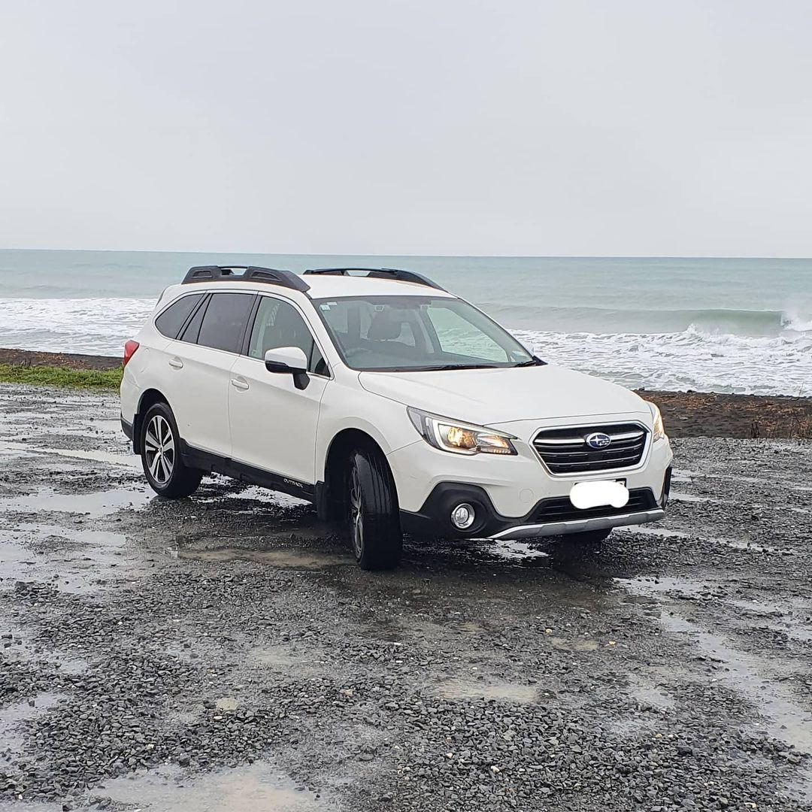

Ever had issues with your job? Of course you have!

When I talk about my job I have a tendency to rave about the amount of driving I do. It's epic! For work I cover an area from Ohakune to Otaki. A while ago now, I transitioned from being a contractor to a bona fide full time employee. As part of that, I switched from using my personal car to being provided with a company car.

I named her White Tiger! Please don't laugh at the name, I thought it was cool.

_I've spent a lot of time in this car._

When signing all the forms for being a full time employee, I did attempt to negotiate for a better salary. I thought what I was being offered was rather… low ball. I wasn't successful here, but as a consolation I was sold on the additional perks of the job. One of these was being able to use the provided company car for full personal use. This was great! I could get rid of my current car and all the expenses that go along with it. White Tiger here would be perfect for everything - supermarket runs, sober driving friends around and taking a certain awesome nephew out and about.

This specific perk was sold to me rather hard. After thinking about it, I thought it was a good deal. Cars are expensive things to run, so not having to do that would almost kind of equal a bit of a pay boost.

But now that's all up for change.

My work is forcing through a switch from Wagon style vehicles to giant, ugly, two seater Diesel Vans.

_Not exactly accurate, but very close._

I don't want this. All these benefits for personal use are gone.

I also mega, super duper very much do not want to do the job I do now in a giant van. Every single working day I drive over some of the worst roads, and doing that in a front wheel drive Diesel tank would make my working life much less bearable.

I work flipping hard at my job! It's extremely demanding with very long hours. My family tells me all the time that I work far too much. I think I push myself hard  due to a combination of enjoying the work and being a bit… loyal to my employer. This change in vehicles really feels like a slap in the face to that loyalty. There was no consultation or negotiation at all, it was just forced upon us.

It's especially sleazy given my employers constant lip service to being environmentally friendly. All EV's by 2030! But we are switching from hybrids to these toxic trucks for now.

I thought I was good at my job. Well, at least some people tell me that I am.
