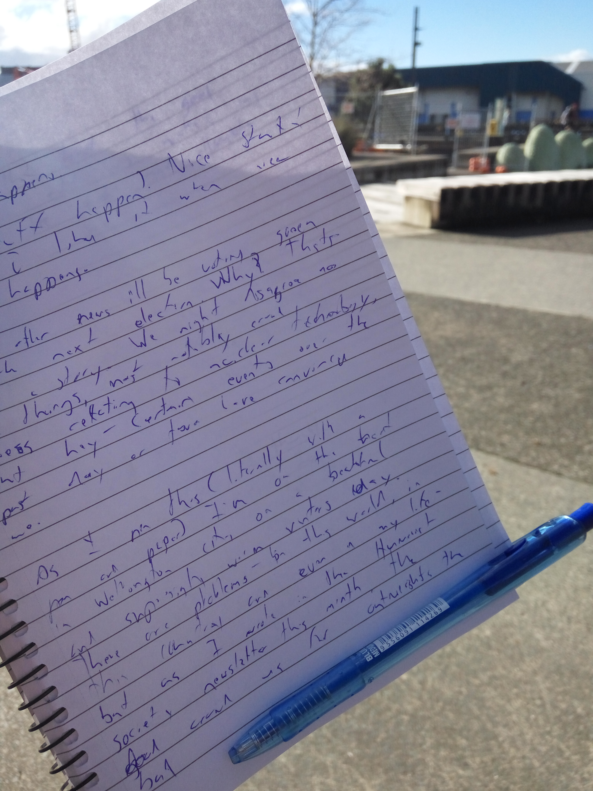

Doesn't stuff happen? Nice stuff happens. I like it when nice stuff happens.

https://www.youtube.com/embed/s4U4FuIyPkc

Oh, in other news I'll be voting Green in the upcoming general election here in New Zealand. Why? That's a great story. I do disagree on things, most notably policies relating to the research and development of Generation 4 nuclear technology, but certain events over the past day or two have persuaded me that this is the right thing for me to do.

As I pen this (litreally with a pen and paper) I'm on the waterfront in Wellington city during a beautiful and surprisingly warm winter's day.

_Inception._

There are problems in the world, in this country and right now in my life. I keep in mind what I wrote in the Humanist Society of New Zealand's newsletter last month – that the tremendous amount of good I observe around me far outweighs the bad. More than that, the good inside each of us is the driving force that makes us strive to fight and eliminate any bad we see.

A brief excerpt:

_In my short lifetime I have seen things like homophobia, racism, and sexual discrimination become more and more unacceptable in most nations around the world. Acts of murder and terrorism done out of hate do still happen, but given that several billion people now occupy our beautiful planet they must be considered a rare occurrence._

The other day I got into a great conversation with someone. She was a very sophisticated and intelligent person knowledgeable about a wide range of issues.

We chatted for hours!

A few years ago I thought me doing that would be impossible. For the longest time I was introverted beyond any level that is healthy. I would just say stupid things that would never come out right. I really didn't put much conscious effort into changing this, but in my striving to get out more I ended up quite by accident improving this skill in myself.

Perhaps this is the best way to learn. I've relied on reading an immense amount of content for many years to learn anything really, but I doubt any number of books or even lectures could give me this skill.

And that's the epiphany I attained. The outcome and prospects for the future can be best described in this great song from all of our childhoods.

https://www.youtube.com/embed/-kl4hJ4j48s

Now I'm in a whole new world, complete with new horizons to pursue.
