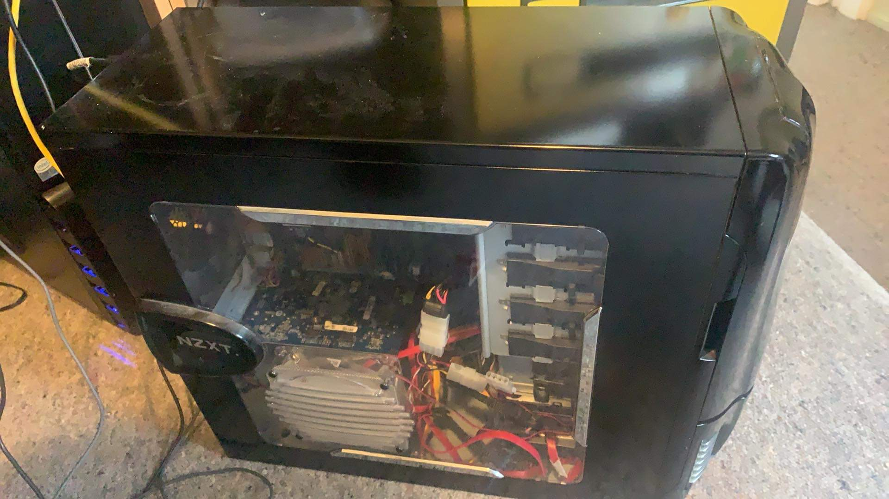
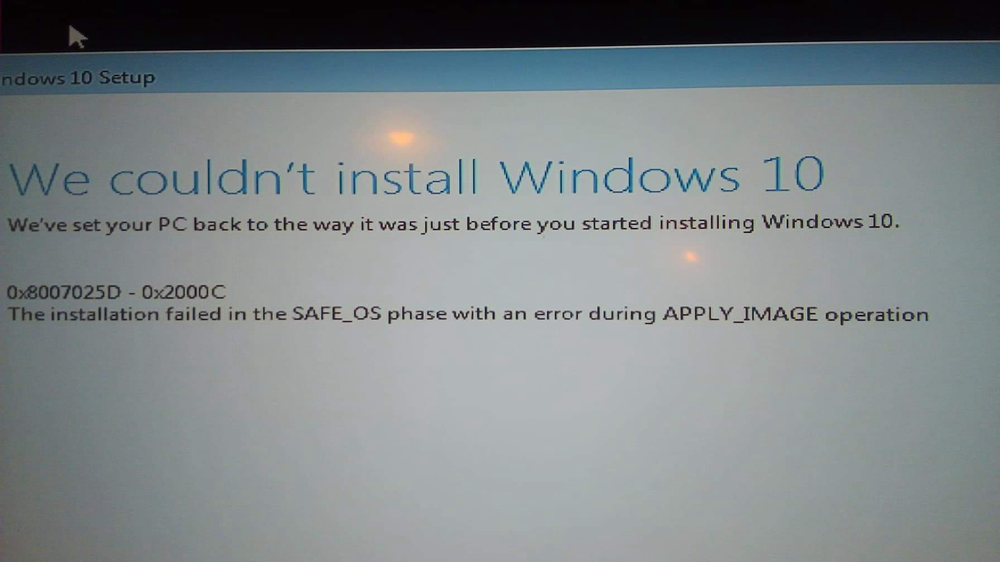

After throwing my friend Mark a surprise birthday party yesterday, I was given the task of getting a decade old Windows machine working and running Windows 10. I was given a Windows 7 Ultimate N key and this computer - a four hard drive behemoth - and set to work.

_My nemesis for an evening._

I plugged it in and turned it on. The lights came on and the fans spun up. The monitor sprung to life!

There was a black screen, no POST beep codes and after a few seconds then everything shut down. Before the fans could spin down entirely, the computer started up again! This was an endless loop that it had got locked into.

My initial hunch was that it was a power supply issue, but a suggestion given to me was that the problem was more likely to be with the memory. I juggled the four memory DIMMs in the four slots available, and managed to fix the issue by having just a single 1GB stick out of 4GB in the machine. Even after this the machine was only intermittently working, sometimes entering the same loop seemingly at random. It still entered the boot loop, but reseating the memory again fixed it. After a while of playing around, the issue seemed to occur less frequently.

Yay, progress!

Next up was sorting out the drives. There were four in this machine, and I was told that the operating system would need to be on the smallest one. I tried removing the drives to look at the labels, but an awkward case design made this difficult. To ensure I knew what size each drive was, I unplugged all but one at a time and then proceeded to boot into the BIOS to get the model numbers, and these included the capacity of each drive.

There was a 1000 GB, a 1500 GB, a 2000 GB and a 250 GB. Easy choice!

I plugged in nothing but that 250GB drive, plugged in my Windows 10 USB installation media, and hit F12 during boot to see the boot menu.

I was presented with odd, 2008 era menu options. I had to choose between USB-HDD, USB-FDD, USB-ZIP, and USB-CDROM. Boot from a ZIP drive! That's a blast from the past. Unfortunately none of them worked for booting from the USB drive. So I bridged the jumpers on the CMOS to reset the BIOS settings, but still no cigar. Going through all the settings in the BIOS and changing everything related to booting and USB support still had no luck.

So I booted up what was on that 250GB drive. It started to load Windows, but it just hung. I rebooted into safe mode and it worked! After a quick Google, I found that disabling all programs and services that start on boot and doing a “clean boot” was a common trick to getting normal Windows to start.

It worked! Here I was in Windows…. 7. Unactivated. The key I was given didn't work. I tried running an upgrade to Windows 10, but that either required an activated version of Windows 7 or a valid Windows 10 key.

Looking carefully, I noticed that they key I had was for Windows 7 Ultimate N. I wondered if the N made a difference to the keys working. I couldn't see any reference to this N version in the Control Panel, so on my laptop I headed over to **[archive.org and downloaded a Windows 7 Ultimate N ISO](https://archive.org/details/Win7UltimateNSP1)** and wrote it to my USB memory stick using the **[Windows USB/DVD Tool](https://www.microsoft.com/en-us/download/details.aspx?id=56485)**.

I ran a clean install of Windows 7, and after an extremely slow install process I entered the activation key. I didn't have much hope.

But it worked! Windows 7 Ultimate N was activated.

Installing Windows 10 using the current activation credentials should be a straightforward process. Downloading and executing the official Media Creation Tool for Windows 10 gives the option not only to make a bootable USB memory stick, but also to upgrade the current machine. On the first try, the installer wouldn't get very far: Windows 10 demands a minimum of 2GB memory. I crossed my fingers and slotted in another memory module. Yay, luck was with me and there was no boot loop.

 It took a few hours to complete the install process, but afterwards I was presented with this:

_It didn't work._

Ugh. Another Google search showed this error can happen sometimes, and a common solution was just to try again. And it worked! After another few hours Windows 10 Pro N was cleanly installed and activated.

It was a 10 year old PC, so Windows 10 runs rather slowly. I figured that what would help would be getting the PC back to its full 4GB of memory! I went back into the BIOS and tweaked any settings related to memory to try to get it working, hoping the issue wasn't something hardware related. I installed another stick of memory, and it booted. Going all the way, I put all four in - the evil boot loop showed up again. I took that last memory module out and reseated it very firmly, really pushing it down and engaging the clips in the sides.

And with luck being a lady, it booted into Windows 10 and showed all 4GB of installed memory. While I don't want to risk testing it, my guess is that either the memory sticks or slots on the motherboard are a bit flakey and abused with age. A little wiggle or shake might make them misbehave, but the hope is that keeping the machine stationary and stable will give it the best chance of running without fault.
