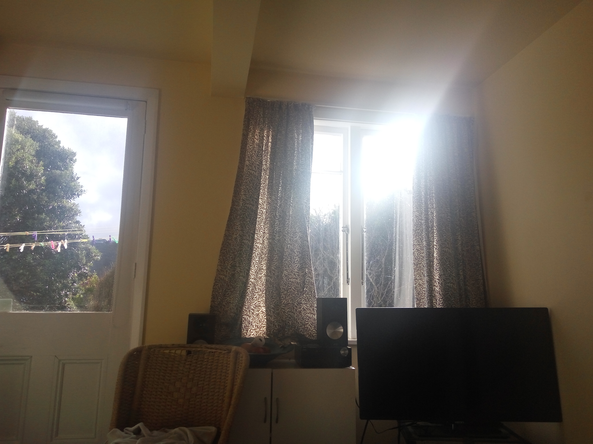

Well, stuff is happening.

Right now the biggest problem I have is my washing machine not working. But that's no big deal, I can just walk out the front door in the morning and let the world have it. It'll make me smell intimidating and masculine, right? I've got the heating sorted, it gets nice and warm pretty quickly too.

I'm slowly getting used to living at my own place. For the first time in many years I'm actually listening to the radio! Nope, not my own music or something broadcast over the Internet. Pure Frequency Modulated broadcast radio. It's comforting and nostalgic! I mean, who listens to radio anymore?

On the plus side it's nearly Friday night and I have plans. That's neat! Looking forward to it. Even the weather is cooperating, so I may even get away without wearing a goofy giant rough weather jacket.

_Can you feel the sunshine, does it brighten up your day?_

I hoped that I would have more traction going on in the work finding area, but thinking about it I'm not too stressed. I have fingers in many pies, and I'm quite content to wait for the right opportunity.

If I am honest I'd really love to get work doing writing of some kind, but those kind of jobs are hard to come by. I have experience with technical writing, creative writing, social writing and even light journalism. Even when it gets a little tedious I still find it to be something I enjoy, and would be extremely eager to dive into a career head first. I have so much time and energy to put into it, I'm sure I would be excellent value to anyone willing to pay me.

Sounds like a great deal, isn't that right [Peer](http://people.ign.com/peer-ign)? How about setting up IGN New Zealand as a one man band based out of the nations beautiful capital?
