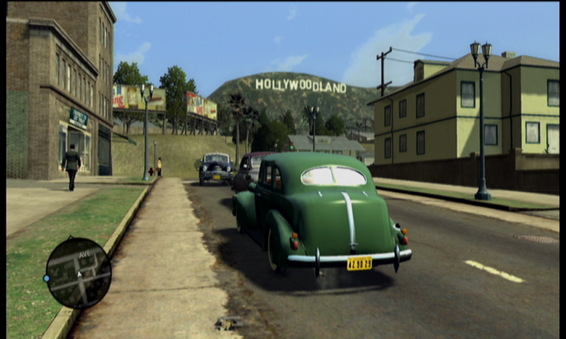
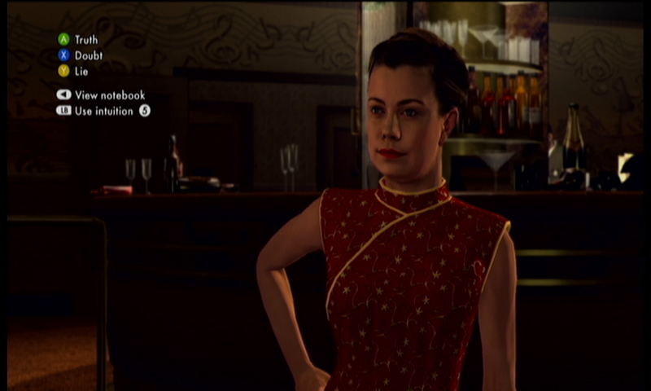

_Every game isn't a winner. Game Failings takes a look back at past games and gives them a critical look with the benefit of hindsight to see if you should pick them up from the bargain bin._

* **[LA Noire](http://www.ign.com/games/la-noire/xbox-360-14249693)**
* **Rockstar Games / Team Bondi**

LA Noire has a very descriptive title, being a game set in Los Angeles presented using the noire film style original pioneered in the 1940's. For most of the games story you play as Cole Phelps, a dedicated LAPD officer and World War II veteran. You team up with a partner to solve crimes from traffic to homicide in the late 1940's City of Angels.

An accurate and detailed representation of 1947 Los Angeles is rendered in an open world that you are free to explore. It looks fantastic, but beyond the critical path of the games narrative there never seems to be anything going on. Outside of a few photogenic landmarks, there isn't anything you can stumble into driving around at leisure. This makes the world strangely dull; people are walking around but never go anywhere and traffic drives in endless loops. If you follow something long enough it can also lead to strange situations. Often cars went right through lamp posts and sometimes a train clipped through cars and stationary wagons with no collision detection at all.

_The recreation of 1940's LA is iconically accurate_

Most of the game is presented as a linear connection of events and locations as you try to solve cases and move through the ranks of the LAPD. You do occasionally have options as to what order you do tasks within a case, but following the location list top to bottom yields the best result. When driving between locations you receive calls over the police radio to respond to crimes in progress, ranging from bank robberies to car chases. These are optional and completely unrelated to the story of the game, completing them is only done for experience and possibly for unlocking new suits for your character.

The biggest failing of LA Noire is when it tries to do combat and action. Hand to hand fighting is far too shallow, using a basic combination of punch, block and grab. On the rare occasions where you fight multiple enemas the lock on targeting is cumbersome, but this is negated by other opponents happily lining up to fight you one at a time. Worse than the fisticuffs is the gun combat sections. The generous auto-aim can be disorienting, often snapping you more than 90 degrees from the direction you're facing. The cover system feels stiff and can be hard to get out of and, worst of all, run and shoot are assigned to the same trigger button.

The most revolutionary aspect of LA Noire is its use of MotionScan, a new type of motion capture technology. Rather than using a special suit or computer guide points, MotionScan uses an array of 32 high definition cameras placed around an actors face to capture full likeness and performance, outputting it as a 3D polygonal model to be implemented in the game. The primary use of this technology is for the interrogation sequences. A key to succeeding is judging the expressions of the interrogatee to interpolate how honest they are being. It does work, but comes off as somewhat strange. The facial capture technology combined with the power of a current generation console causes a significant lack of detail and fidelity, causing the actors to be more flamboyant with their use of expressions than seems natural. Everyone in the game comes across like they've had way too much coffee, with their bodies and heads moving completely separately and twitching in strange and sharp ways.

_Always be a good judge of character_

Watching the extremely long list of credits emphasises the huge budget LA Noire had. The game had a long, 7 year development cycle that involved publisher and platform changes and even some scandal. Allegations that the studio had developers work in poor conditions and that key staff did not receive any credit gave the game significant controversy and attention shortly after its release. To date LA Noire has sold close to 5 million units. Due to the tremendous budget and long development time there is speculation that even these sale numbers weren't enough for the game to make a profit. It's clear that Rockstar wanted this genre to become a staple, something they could release to similar hype and acclaim as Grand Theft Auto. While the official word from Rockstar is that the game was very successful, it doesn't seem to have retained a high level of public opinion.

Rockstar still retains the rights to LA Noire, but it's not certain if a potential sequel would follow the first games story or setting. The new genre and technologies pioneered by the first game could be adapted to a variety of settings. One of the leads from LA Noire is independently helming _Whore of the Orient_, a spiritual successor using the same MotionScan technology and a similar narrative style.

	<iframe class="youtube-player" type="text/html" src="https://www.youtube.com/embed/fc_Mww4Ra5k?start=0" frameborder="0" allowfullscreen=""></iframe>

When LA Noire was released in early 2011, former IGN glory man Hilary Goldstein [reviewed it with an 8.5 score](http://xbox360.ign.com/articles/116/1168433p1.html). Most reviews aligned with this, although certain reviewers were far more negative from the outset. The great attention to detail received universal praise, but the same failings that are discussed here were apparent in most reviews.

Despite being only two years old, LA Noire hasn't aged well at all. The general excitement of the facial capture technology has gone and its flaws are now more apparent than ever. The game utilises this technology so much that its dated look will only get worse as time goes on. If the idea of a film noire inspired period piece is appealing, you will find fun with LA Noire. But for most people the glaring issues will be enough to put you off investing in this game.

_Do you know any games that deserve a second look and should have a Game Failings? Leave your suggestion in the comments below or let me know over Twitter - @[aaronights](http://twitter.com/aaronights). _
