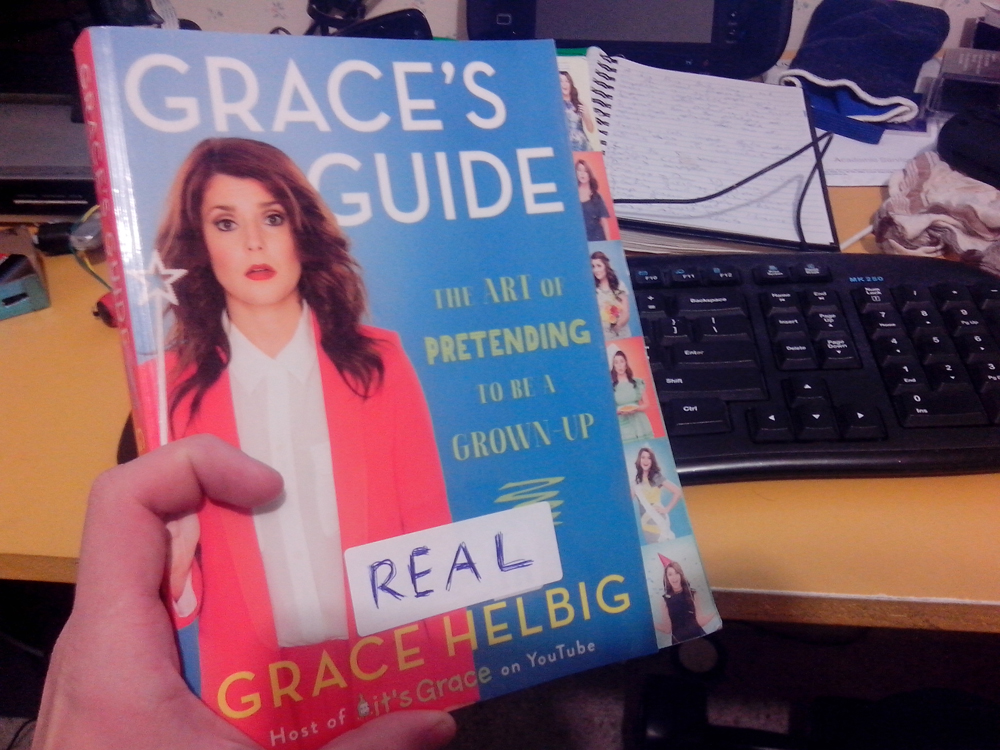
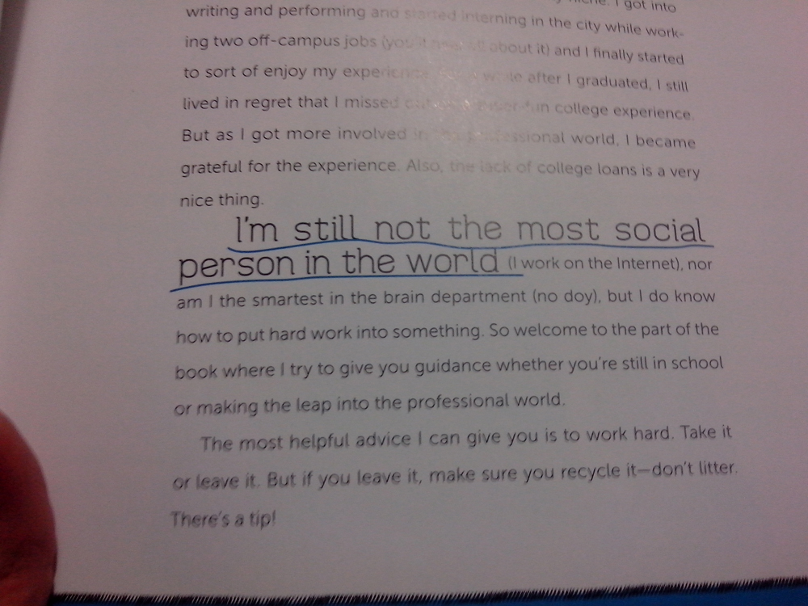

_I know that this isn't the most ideal location for something like this, but it's the only blog I have that gets readers!_

My job demands technical writing. I enjoy it, but it's not something that scratches the imagination and creative itch I get. I want to share something that's been buzzing around my consciousness aimlessly for a while now. And I'd like your perspective.

For a long time I've been writing a story.

I debate that the best part of any story is the faceless exposition. Characters were such a pain. Why would you want to learn about characters when there is a world that I've crafted! A whole new world versus some people! I wanted to break my story out into a spreadsheet and use that. Have columns representing increasing time and rows parallel scenarios and locations. Unfortunately no one wants to read something like that.

_Not an actual story. Although what will Dave do in that hole?!_

I needed to develop characters. Strong characters, ones that could carry such a farfetched story. I found that so hard. So I tried a long term exercise to help broaden my horizons in this regard.

Surely everyone knows [Grace Helbig](https://www.youtube.com/user/graciehinabox). Video blogger, book writer and TV show person extraordinaire.

I like Grace. She is neat.

However, for many purposes she is fictional.

In order for something to seem real, it must have interaction (well, at least in my crazy mind). While that could be possible in some slim way, it's not really practical when it comes to something like a superstar. Like any hyper popular celebrity, interaction is rounded to zero. Passive observation doesn't make something tangible, graspable or real.

So I interpolate. Fill in gaps to make the person real, just like they did with frogs to the dinosaurs in Jurassic Park. I put my imagination in overdrive to craft something. This doesn't override the real Grace, but makes a new entity.

Imaginary Grace.

Because, why not? For all of my possible intents and purposes, Imaginary Grace is just as real as Real Grace. From my perspective, they both live in Fantasy Land. To be clear, I've done this with many people. (You should meet Imaginary Gary Busey, that would be crazy.) If you can't interact with the person, if you can't present scenarios, if you can't run input and output tests, why would you stick to the real person with all the gaping holes in information? All the same impracticalities remain. I don't even 'simulate' scenarios of what Imaginary Grace would do, it's just kind of a person that kind of exists.

Also, Imaginary Grace doesn't interact with me. An imaginary version of me doesn't exist in her world. Not only would that be boring, it'd shatter the illusion of what Imaginary Grace is. I know myself rather well, I can interact with myself (not like that!) and present scenarios and get an outcome with me. I do that every day!

Imaginary Grace is reasonably fluidic in form, not ridged in who she is. But as a few tips:

* Her favourite song is ['I Want a New Drug' by Huey Lewis and the News](https://www.youtube.com/watch?v=N6uEMOeDZsA), ever since she heard it live in 1990.
* She hates hard, starchy cloth. It feels dirty.
* Romances the Sixties. Explains the hair.
* Loves inflatable furniture, especially the sound it makes. Sqeeeeeel.
* Random things are beyond hilarious to her. Like making pants from Bicycle Chains or replacing the shocks in someone's car whose just had back surgery with Steel Bars for a prank. But she wont be happy if someone does this to her.
* Imaginary Grace is a sore looser.

They're not things that I have in common, ether. I'd give more examples, but writing them all down takes away from the fluidity of who she is. She does have attributes of Real Grace, but an override occurs when there is a conflict with an attribute of Imaginary Grace. I'm not even someone to watches every last bit of Real Grace's videos and all the content she produces, so I'm sure there are many, many conflicts I'm not aware of.

Some things don't even line up. Real Grace is about the same age as me, so would of been close to four in 1990. But Imaginary Grace isn't confined to time, so she was dancing in that stadium to Huey Lewis as her current self - in 1990!

Imaginary Grace isn't perfect, or some kind of ideal women, human or role model. She's a character, an interesting character. An analogy: A prefabricated house. It has parameters that are defined. Some can be changed, some can't. Change the paint colour, remove a wall, add a wall, put a bowling alley in, decorate it with leopard print wallpaper. It's still a prefabricated house, it has the same shape and the same structural design but it's different.

I made a character. A fictional character! Well, partly.

To be clear, I don't sit down and come up with these things. It's often when I'm desperate to occupy my mind. I used to listen to hours of podcasts a week, but I've found that too distracting and, well, difficult lately. I drive a lot and have been in many scenarios of long periods of waiting recently.

However, a while ago something that threatened the reality of Imaginary Grace happened.

I read [Real Graces book](http://www.gracesguidebook.com/). Twice!

_Labeling so I don't get confused_

I really, really didn't expect it to hit so close to home. I'm so far outside of the teenage girl target demographic. I don't know why, but I was fully expecting fluff, the focus to be a punch line complete with a rimshot on every page. And often, there was. But wait! Stuff was relatable. I'm a hermit! I litreally work in two places; A desk 5 meters away from where I sleep, and a workshop about 15. I hate socialising! Any friends I've had moved on to things like a wife and kids, or backpacking around Europe. (Europe is disgusting, gross.)

_Join the club, it never meets._

The intense personal section in the book creped me out. Imaginary Grace doesn't have a personal life, at least not one I'm privy to. Half way through my first read of the book I was thinking Real Grace believed every problem was a relationship problem. Imaginary Grace wouldn't care. She's too stubborn.

Also, in every photo shoot in the book Real Graces eyes are so extremely close to being similar in size that the small, tiny difference makes her seem strangely alien. But not Imaginary Grace! She's violently unsymmetrical 24 - 7. Think a pirate, but not as much of a hobo.

Something was wrong. Real Grace was seeming more Real. But no two way interaction! It didn't read like a broadcast to millions of people, it was eerie and personal. No! You're killing Imaginary Grace, Real Grace! Stop! If you were Imaginary Grace I could make you stop! But Grr, Real Grace being Real made that impossible. I still read the book. Twice.

So an unstoppable force (Imaginary Grace. She's unstoppable!) was meeting an immovable object (Real Grace. Reality can't be moved). Smart people have debated this scenario for years with no answer. The answer is the third thing.

I made the third thing. I forced myself to invest in developing a character from scratch. I still don't know what that person looks like in great detail. But I can grasp his consciousness in extreme detail.

Real Grace is still real, but in Fantasyland. Imaginary Grace still exists, in a different Fantasyland, but I really want to change her name now. Maybe her next fad will be an eyepatch. Also, she wants a new drug. One that doesn't come in a pill, make her skin break out or make her feel three feet thick.

But now I have something I own. I did it! It's tremendously invigorating to own a character entirely. The exercise of dealing with Imaginary Grace was a tremendous help in expanding my creative horizons, but using her felt way too uncomfortable. Real Grace might be a person in Fantasyland, but using her for a prefabricated model in something substantial, something 100,000 words long, wasn't right.

The lead character in my story is very different to Imaginary Grace. I try to run a scenario about them meeting, but it's beyond my brain capacity.

The story is complete, but needs polish. I trimmed it way down to meet the requirements of a couple of short story competitions. I will share the whole thing, but agreements mean I have to wait. I doubt many will love it. It's long, detailed and things happen in violent spurts. Any intense action is largely observed by the characters rather than having interaction with them. It's all in the third person, the characters are the anchors to allow the story to flow. But it's what I wanted to write!

Does anyone do things like this? I've heard of fictional characters being based on real people, but I'm super curious if this particular scenario has happened. I tried to research, but couldn't figure out what to type into Google to get the result I'm after.

I know I'm strange, don't tell me that. But I'd love feedback - [@aaronights](http://twitter.com/aaronights).
