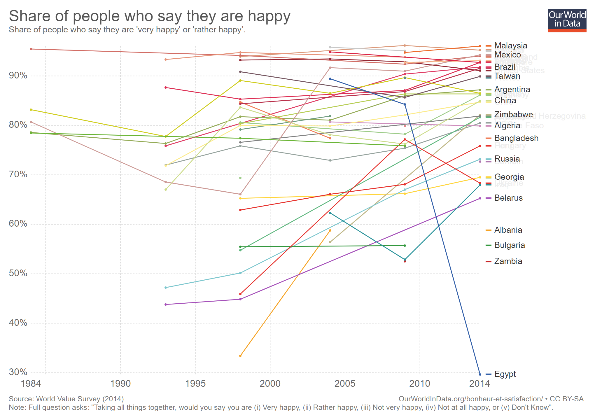

A common claim made by some religious doctrines is that the world is in an awful state, and that humanity is deteriorating. In many Christian denominations this is based on so called prophecies that are claimed to have been made thousands of years ago. It is generally stated that mankind, growing distant from their deity, would just hit the fan.

A common claim is this: We are living in horrific times full of hateful atrocities worse than any other time in history, and the only way out is through supernatural salvation by an all powerful deity.

A tactic used is to then appeal to emotional decision making to reach a conclusion. Rather than presenting statistics or facts, rhetorical questions are asked about the status of humanity and the world.

* _“Have you noticed a general downward trend in people’s attitudes?”_
* _“Have you noticed that the world is becoming increasingly filled with violence?”_
* _“Have you noticed that major wars, famine, poverty, lawlessness and even a lack of love have become common place in modern life?”_

These are all very big claims, and importantly they can be proven true or false with research and statistical information.

## Attitude

This is a broad topic, tough to pin down to a specific metric. Generally, I assume attitude would be how happy people are, and how well they treat each other.

The best source of information I could find relating to happiness doesn’t extend back centuries, but only a few decades. Dating back to 1984, [The World Value Survey](http://www.worldvaluessurvey.org/wvs.jsp) asked the following question:

Taking all things together, would you say you are:

1. Very happy
2. Rather happy
3. Not very happy
4. Not at all happy

_All those lines! More going up than down._

[This chart represents the percentage of people that answered either as being Very happy or Rather happy, plotted against time](https://ourworldindata.org/grapher/share-of-people-who-say-they-are-happy?country=ALB+DZA+AND+ARG+ARM+AUS+AZE+BHR+BGD+BLR+BIH+BRA+BGR+BFA+CAN+CHL+CHN+COL+HRV+EGY+FRA+GEO+DEU+HUN+IND+IRQ+JPN+MYS+MEX+PER+POL+RUS+SGP+SWE+CHE+TWN+THA+UKR+USA+URY+ZMB+ZWE+CYP+CZE+DOM+ECU+SLV+EST+ETH+FIN+GHA+GTM+HKG+IDN+IRN+ISR+ITA+JOR+KAZ+KWT+KGZ+LVA+LBN+LBY+LTU+MKD+MLI+MDA+MNE+MAR+NLD+NZL+NGA+NOR+PAK+PSE+PHL+PRI+QAT+ROU+RWA+SAU+OWID_SRM+SRB+SVK+SVN+ZAF+KOR+ESP+TZA+TTO+TUN+TUR+UGA+GBR+UZB+VEN+VNM+YEM). While there are exceptions, such as Egypt and the United States, the trend is that happiest is staying level or increasing. But even in absolutely terms, the most recent 2014 survey results show that the majority of nations have far more people reporting to be happy than are not. All 2014 nations have over 60% of people claiming to be happy with most reporting above 85%.

This is information showing that most people are happy, and that by far the majority of people are happy.

For more information about statistical happiness:

* [Happiness and Life Satisfaction](https://ourworldindata.org/happiness-and-life-satisfaction/) by Esteban Ortiz-Ospina and Max Roser, found on Our World in Data
* [World Happiness Report 2017](http://worldhappiness.report/ed/2017/)

I read and researched the above two sources extensively and could find no evidence of a decrease or worsening of peoples attitudes as it relates to happiness. This is the toughest statistic to track! If anyone has a better source of information, either supporting on conflicting with my conclusion, please let me know.

## Violence

Is violence increasing? No.

Less people than ever in history are dying as the result of human violence than ever.

	<iframe class="youtube-player" type="text/html" src="https://www.youtube.com/embed/ramBFRt1Uzk?start=0" frameborder="0" allowfullscreen=""></iframe>

Torture, punishment and even the death penalty is less common than ever. [The rate of homicide is at its lowest ever.](https://ourworldindata.org/homicides/) In even nation in the world, including third world nations, people in general are less likely to be the victim of physical violence now than in any time in recorded history. Violence motivated my racism, sexism, homophobia and even religion is seen as an increasingly disgusting thing. [Violence and mistreatment of children is becoming less common.](https://ourworldindata.org/violence-against-rights-for-children/)

For more statistics and information regarding rates of violence:

* [The Visual History of Decreasing War and Violence](https://ourworldindata.org/slides/war-and-violence/#/title-slide), from Our World in History
* [History of Violence: a TED Talk](https://www.youtube.com/watch?v=sjT4HlNJNgI) by psychologist Steven Pinker

## Poverty

Are many people today living in extreme poverty? Sadly, yes. But despite the population of the earth fast going above 8 billion, [the number of people living in extreme poverty is at its lowest for the past 200 years.](https://ourworldindata.org/extreme-poverty/) It has been on a downward trend since the 1970s. Very vulnerable and exploited nations located in sub-Saharan Africa still big issues, with close to 40% of their populations living in extreme poverty, but this is a historical low for the region.

## Famine

[The rate of people dying as a result of famine is at a low.](https://ourworldindata.org/famines/)

## War

No great powers in the world have been at war with each other for over half a century. Since the end of World War Two, the absolute number of people that are dying as a result of warfare has declined. The proportion of people that die in wars is lower than any historical engagement. Many nations in the world used to have raging internal conflicts - from the land wars here in New Zealand, civil war in the Americas and tribal warfare sweeping across the African continent. Nations are working together without bloodshed and violence. War is still a problem in the 21st century, but it may very well be at its lowest point in human history.

_"Violence has been in decline over long stretches of time"_, says Harvard professor Steven Pinker, [_"and we may be living in the most peaceful time in our species' existence."_](https://ourworldindata.org/slides/war-and-violence/#/5)

Even more than a decline in bad things, there is so many advantages to living today. In every nation on earth life expectancy is at a record high and [still going higher.](https://ourworldindata.org/life-expectancy/) Child mortality is [getting better.](https://ourworldindata.org/child-mortality/) Horrendous diseases like Polio are on the decline and may almost be [eradicated in the next decade.](https://ourworldindata.org/polio/) The number of people smoking [is decreasing.](https://ourworldindata.org/smoking/) Healthcare is far better and [more people have access to it now than ever before.](https://ourworldindata.org/financing-healthcare/) More people are literate and are [getting an education.](https://ourworldindata.org/global-rise-of-education)

Politics is a hostile issue that seems to dominate the headlines. The United States has a President that is reaching all time lows in so many areas. But people are speaking up and criticising! They are openly challenging and fighting what could be the most powerful man on the planet. It was barely a few centuries ago that speaking out against a King, Emperor or other powerful leader could result in torture or death.

We are not there. Humanity still has such a long way to go to! While so many things are better now than ever, it doesn’t mean we have reached the ultimate goal state of these things. Plus, we face issues around climate change, substance abuse and sexual bigotry.

But we are getting there. If someone states that the world has become a horrible and loveless place, insist they back it up with facts and statistics.

What is it like now, and when in history was it any better?
