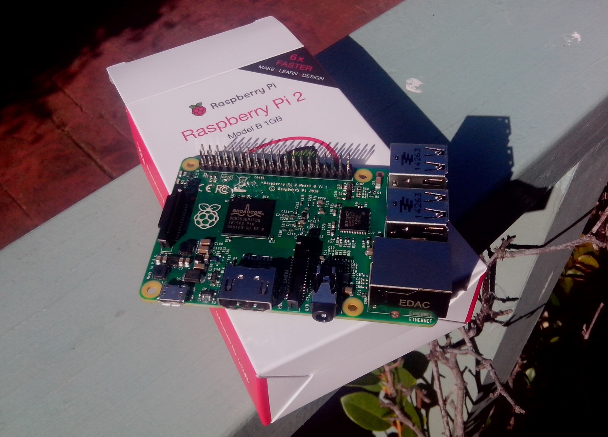
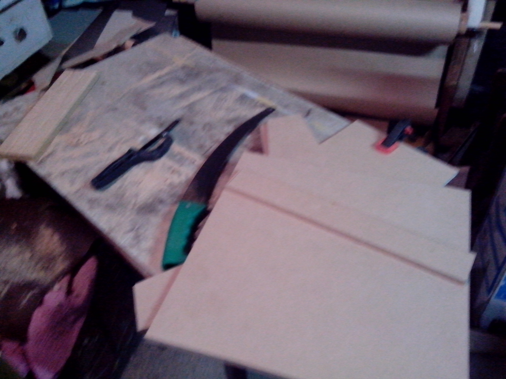
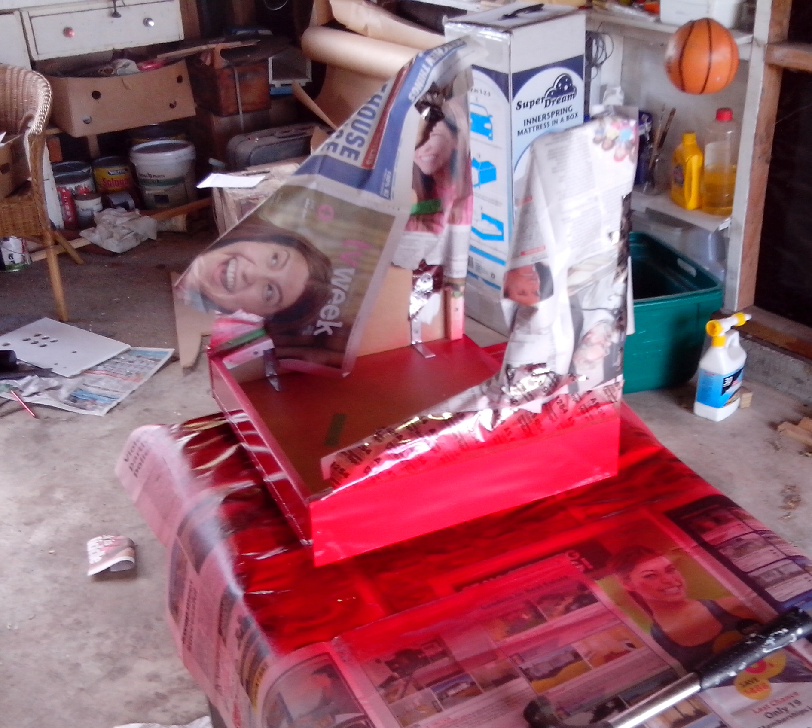
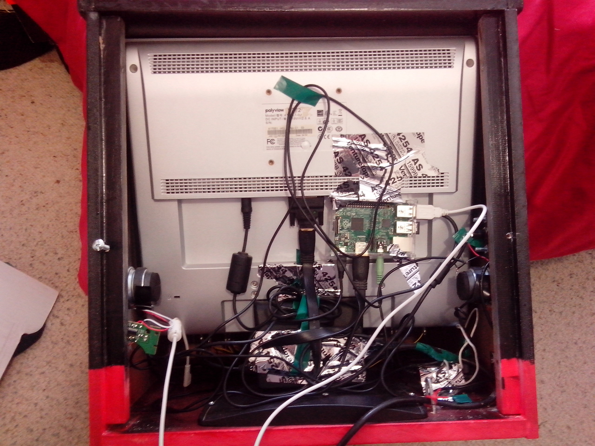
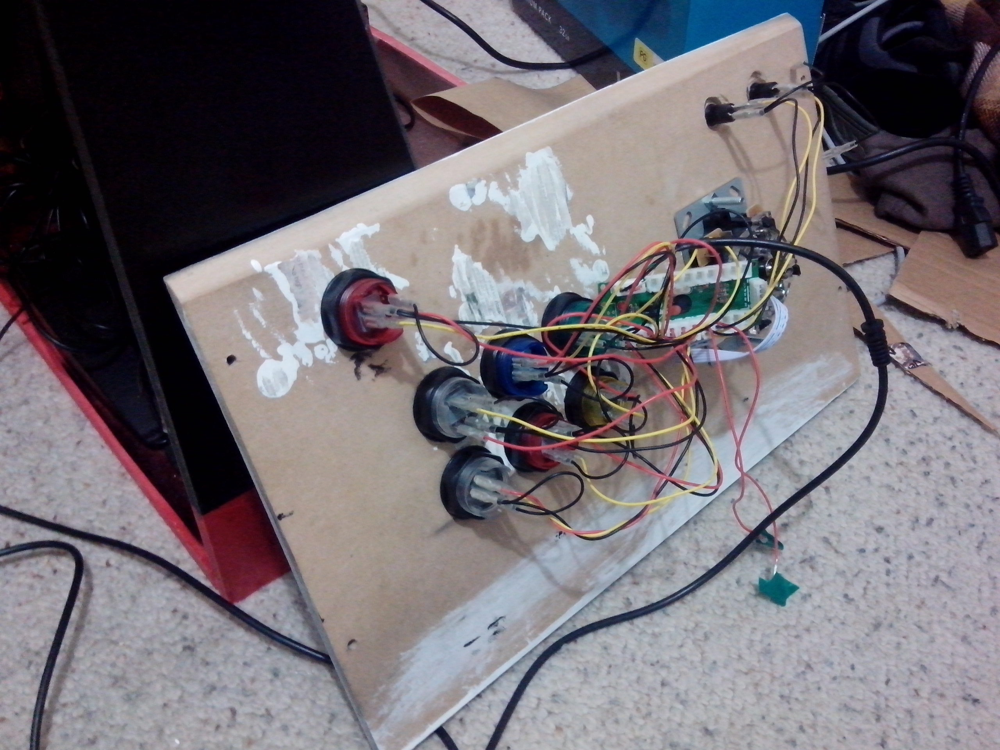
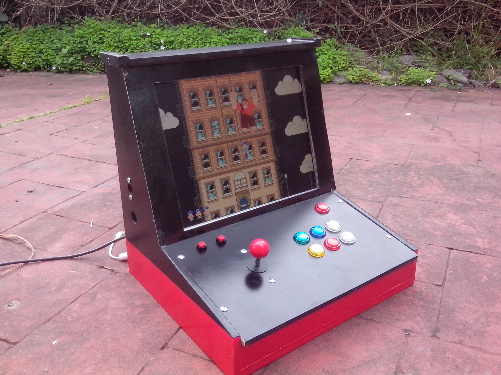
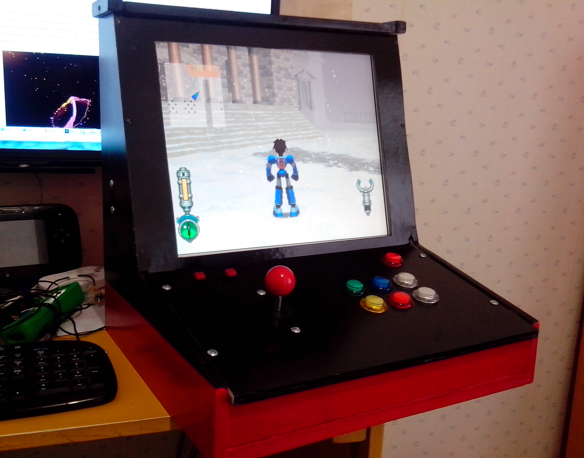
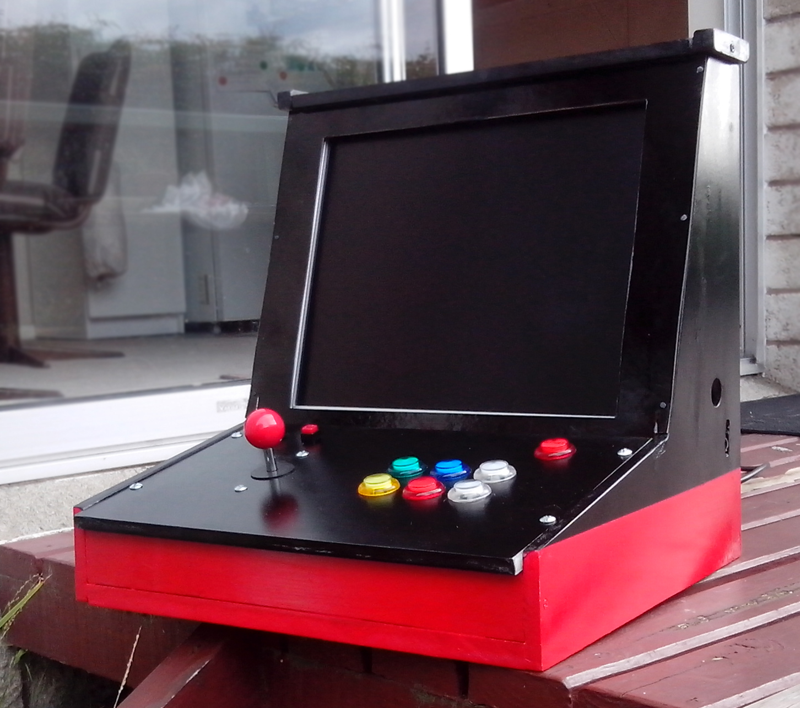

For a while now I've been wanting to do a project with the Raspberry Pi. The ultra low cost, single board computer is making roads in both education and the do-it-yourself maker scene. It's a great platform to learn programming and basic electronics, and the heart of many enthusiast projects. After thinking about what I could make, I settled on an emulation-based arcade machine.

The new Raspberry Pi 2 pushes platform over the hump to be the ideal brains inside a homemade arcade system. Not only does it give you reasonably fast loading times and smooth menu navigation, but its quad-core Broadcom processor allows for emulation of power demanding games and platforms. The Pi platform also has a big advantage for an arcade machine - the General Purpose Input/Output pins allows standard arcade stick and buttons to be directly wired up to the unit, without any need for a keyboard simulator or any kind of USB controller. Using the Retrogame software, it's just a matter of connecting each button or joystick direction to both an unused I/O and a ground pin.

_The new Raspberry Pi 2_

A big factor in any arcade unit is the choice of monitor or screen. Natively the Raspberry Pi can output a HDMI signal at resolutions up to full 1080p, or an older Composite video signal like every console in the 90's used. If you have a CRT or other older monitor you can get [a cheap, sub $20, adapter](http://www.adafruit.com/products/1151) to let you use a VGA connection.

## Building

The monitor I used was an older 17" LCD. A big factor in my choice is that is has a good old, 4:3 aspect ratio. A widescreen monitor will work fine, but you'll be stretching the picture or wasting space with black bars on either side if you are emulating retro systems not designed with widescreen in mind.

For the sake of portability, my build was a bartop unit rather than a full stand up machine. Both the monitor I use and this small size will limit it to 1 player controls, but I'll keep a USB gamepad handy for multiplayer games.

_Oh the dust_

I built my unit out of 12mm MDF. Good quality plywood would be a lighter solution, but can be a pain to paint and has a tendency to split and crack. I opted to hand cut all my pieces. It does involve cutting a bit bigger then you need and working your biceps with some heavy sanding and a solid sanding block. A jigsaw would work, but remember to take it very slowly and be prepared for mistakes. The ideal solution is a standing joiners band saw - if you can get a professional to cut out your designs you'll get the best result. No matter what you use, there will be a huge amount of dust from MDF. Don't breathe it in! A cheap mask is worth the investment.

Any good power drill should be enough to cut the holes out for buttons and joysticks. Look for a Spade bit at the hardware store. Always get a size on the smaller size rather than larger to ensure nothing rattles and has a tight fit.

A cheap wood glue is good just to hold things together before putting screws in. I fixed the sides to the base, but used nuts and bolts for the controller board so it can be easily removed for maintenance and even help out with the assembly process.

I used a bit of thick card from a craft store for the bezel around the monitor. It's not structural in any way, so doing this saves some weight compared to using more wood.

_Painting_

For a nice finish I gave all the wood a good undercoat then sanded it down with a really high grit sandpaper until it was really smooth. A professional unit would get a vinyl stick on decal filled with graphics out of the 90's, but I needed to be cheaper. I went with a two tone spray paint finish. Red and Black, just like the Raspberry Pi logo. The main rule when spray painting is many, many thin light coats. Don't linger too long over a spot or it'll get patchy and run. For sound I took apart a set of cheap, USB powered, speakers. They wont sound amazing, but can plug directly into the Raspberry Pi. I mounted them in the sides - having them inside a marquee banner above the screen would be ideal, but I skipped this to keep the size down.

You can wire the power for the Raspberry Pi and the monitor directly, but if space isn't an issue you can just put a power strip or double adapter in the unit. The Raspberry Pi itself is powered through a microUSB connector, just like the majority of cell phone chargers. If you experience continual and seemingly random errors it might be due to your power adapter not supplying enough juice. Check the label on the adapter to see that it provides at least 1 amp (or 1000 mA) of power. A 2 amp adapter is ideal, especially if you intend to plug several USB devices into your Raspberry Pi.

_Everything secured in place with tape._

Wiring up the buttons is the toughest part. First, [look at this diagram](http://www.element14.com/community/docs/DOC-73950/l/raspberry-pi-2-model-b-gpio-40-pin-block-pinout). It's the layout of the pins on the Raspberry Pi, and it can seem very confusing. Pick one of the pins labeled GPIO for each button you want to wire up, and pick four for a joystick (one for each direction). You need to wire these to one of the connections on your arcade buttons, and the best way to do this is using a set of super inexpensive [female jumper wires](https://www.adafruit.com/products/266). The buttons you buy might come with suitable wires for the connections, so try and look for a good deal. The second step is to wire the other connection on your arcade buttons to one of the ground pins on the Raspberry Pi. Unlike the GPIO pin, the ground pin does not have to be unique to each button. You can daisy chain as many buttons as you like to just one ground pin, and if you want more than five or six buttons you'll have to. The same applies to connecting joysticks.

_So many wires_

Note that if you're using an older Raspberry Pi the same principle applies, but you'll have less pins in a different layout to work with. To work out what model you have, just count the pins! The new models have 40 pins, and the older ones have 26. Use [this pin out chart](https://www.raspberrypi.org/documentation/usage/gpio/) if you have an older Raspberry Pi model.

## Configuring

To make the arcade controls work once connected, you'll need to install the [Retrogame software](https://github.com/adafruit/Adafruit-Retrogame). This maps the signals your arcade buttons make to buttons on a keyboard. It can be a bit confusing to follow, if you need help look at the instructions on the Retrogame Github page.

My plan was to use the GPIO pins for the arcade controls, but the kit I ordered came with a USB based encoder with all the necessary wires. USB arcade controller boards work great, and most gaming Operating Systems for Raspberry Pi have all the drivers for these kind of devices built in. If wiring the pins manually seems a bit confusing, it's worth looking into.

I edited the configuration files on my Raspberry Pi to force it to output at a low, 640x480 resolution. This did slightly boost performance, but my main reason was to get crisp, sharp edged pixels for all the retro games. Having the Raspberry Pi run at the higher, native resolution of my monitor gave games a more smooth and scaled look. Try both to see what you prefer.

There are many different operating systems for the Raspberry Pi that are great for an arcade system. [Cupcade](https://learn.adafruit.com/cupcade-raspberry-pi-micro-mini-arcade-game-cabinet/hardware-setup) and [recalboxOS](http://www.recalbox.com/) are common, but for my system I used [RetroPie](http://blog.petrockblock.com/retropie/). Installing it is simple, just plug your SD card into your PC and install whatever Operating System image you want. The [RetroPie Wiki](https://github.com/petrockblog/RetroPie-Setup/wiki) has a great tutorial if you need more help with the installation process.

A few things to keep in mind with RetroPie:

* You will need to configure your controller or arcade controls twice; for the EmulationStation menu where you navigate between your games, and again for the emulators themselves. Some emulators, like Nintendo 64, also need to be configured separately.

* RetroPie has a setup script that gives you access to some extra settings, including installing experimental emulators that are still in development. Access it from the RetroPie menu, but keep in mind you'll need to plug in a keyboard to navigate the options in the script. The Raspberry Pi also has a similar script for more core system features.

* You can access the standard Linux command prompt at anytime with F4. Because RetroPie is based on the very common Raspbian OS, most additions and tutorials written for the Raspberry Pi should work.

* By default, RetroPie runs a standard network share that lets you copy over files and games. It's called simply RETROPIE.

There are a lot of free ports installed by default, including the shareware versions of Doom and Duke Nukem 3D. It's not an arcade style game, but the port of Cave Story works great. There is a huge range of homebrew games available for most retro systems; [nesworld.com](http://www.nesworld.com/article.php?system=nes&data=neshomebrew_bestof) has a great selection and a favourite of mine is [Fix it Felix Jr](http://68000.web.fc2.com/felix/index.html). for the Genesis, based on the focus game in the Disney movie Wreck-it Ralph. As always, using copies of commercial games that you do not own is illegal and you're on your own to find them.

_I'm gonna wreck it!_

## Final Thoughts

This took longer to do than I expected. Planning, cutting and configuring was a fairly large task that I thought I'd do in a few hours, but ended up doing over a few free afternoons. The final unit is also far heavier than I would have liked. All advice and research was to use 12mm material, but I'd consider going thinner and lighter if I did it again. By far the best thing about building something like this is the huge community around both the Raspberry Pi and the whole maker scene. If you get stuck or lost there are several communities where you can research and even ask for help.

_MegaMan Legends 2 running perfectly_

An alternative to an arcade machine is building a handheld Gameboy-like system powered by a Raspberry Pi. Adafruit has [a guide here](https://learn.adafruit.com/pigrrl-raspberry-pi-gameboy?view=all), and the (now former) Fragdoll Sabre has [a great video breaking it down](http://www.google.co.nz/url?url=http://www.youtube.com/watch%3Fv%3DRXpgLFpSBHY&rct=j&q=&esrc=s&sa=U&ei=Zgk3VcyWAcHOmwWW0YHYDw&ved=0CBYQtwIwAA&sig2=9n0_thEx4P5EhIFahjzRTg&usg=AFQjCNHWo8P5VgI5-VZ0p7___LKQA-7CRg). Most smaller projects like this require a 3D printer - if you're interested in this it's worthwhile to research if there is a maker space or other community centre in your area that will let you print out your parts.

Another retro gaming project would be to gut out the inside of a broken Super Nintendo or Genesis and turn it into a neat case for a Raspberry Pi PC. You can also buy a huge range of different cases premade for the Raspberry Pi or make one yourself with your own stylish finish. Just about any USB controller will work, including wired Xbox 360 controllers and wireless Playstation 3 controllers if you use a USB Bluetooth adapter.

If you're after a different type of project, [Adafruit has guides](https://learn.adafruit.com/) for a huge range of guides. It's also the store I'd recommend to buy all your parts and Pi's, including joysticks and buttons. They're based in New York, so if you are in North America you won't have to wait weeks for shipping from Asia.

_Overall, I'm pleased. It's my first time building something like this and it came out reasonably well. The paint finish might be a bit patchy and it's very heavy, but it is fully functional. I still wouldn't call it fully finished as I'll probably try and touch up a few things when I get the spare time. And then there is my next project - mounting a Raspberry Pi and a small touch screen in the dash of my 1983 Toyota._

If you have any questions or suggestions please comment below or hit me up on [Twitter](https://twitter.com/aaronights). If you're attempting a project similar to this I'm happy to help out if you have any specific questions.
