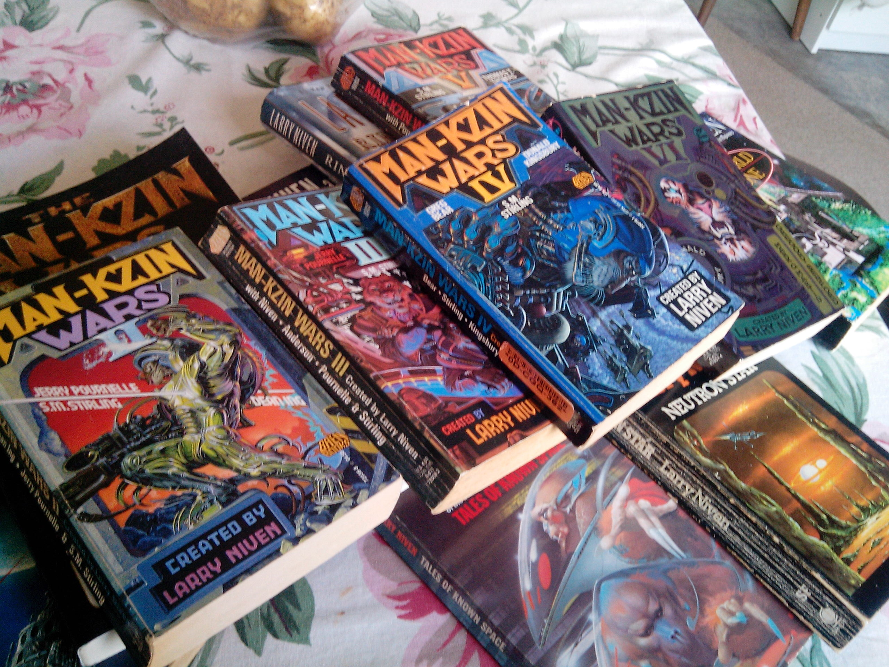

For many years now I've been interested in trying to do fictional writing. I've started many stories, but often become frustrated at my lack of ability to put pen to paper before finishing. But now I've finally completed a short story I can be somewhat proud of, and I would really like to hear your opinion.

Like [other very popular and successful stories](https://en.wikipedia.org/wiki/Fifty_Shades_of_Grey), it started in the world of fanfiction. Larry Niven's Known Space universe had its first story in 1964 and includes some of the most renowned hard Science Fiction books like _World of Ptaavs_, _Neutron Star_, the _Fleet of Worlds_ series (done in collaboration with [Edward M. Lerner](http://blog.edwardmlerner.com/)), and the spectacular and award winning _Ringworld_. The shared universe of all the stores have a foundation in hard science fiction, spending time to justify, explain and somewhat romance the scientific principles used - both those based in current science fact and those created for the story.

There are around main 15 novels and a range of short stories set in Known Space, but the largest output of content is in the spin-off Man-Kzin Wars series of anthology books written by Niven and many other authors. These are published by the almost exclusively science fiction and fantasy publishing house [Baen Books](http://www.baen.com/) since 1988 and are still being released. Chronicling the hostile encounters between humans and the prideful feline Kzinti aliens, there are currently 14 main volumes along with two stand alone books in the Man-Kzin Wars saga.

A few personal favourites of mine are:

* **_The Warriors_ by Larry Niven, from Man-Kzin Wars**: A very short origin story, detailing how one of mankind's early slowboats to the stars encounter something
* **_Madness Has Its Place_ by Larry Niven, from Man-Kzin Wars III**: How a generation of humans that had forgotten war resort to drug induced Schizophrenia to come up with ways to fight the new threat from the stars.
* **_The Survivor_ by Donald Kingsbury, from Man-Kzin Wars IV**: An exceptionally well written story from the perspective of a young alien Kzinti. Writing from the perspective of an alien without using common points of reference that only a human can know is an extremely difficult task, but this story does it flawlessly. It also provides added insight and perspective to previous stories in the series.

If you want more information [Wikipedia has a dedicated page](https://en.wikipedia.org/wiki/Man-Kzin_Wars), but I'd recommend reading a story before getting filled with spoilers. The best place to start is the first volume and thankfully that was re-released in 2013 as a 25th anniversary edition, both digitally and physically.

I've still yet to read every book in the series - the older ones are out of print and aren't available digitally. Still, my collection is slowly forming.

_The non-digital part of my book heap._

The genesis of my story started with a short fact mentioned in the 1967 short story Flatlander (available in both the _Crashlander_ and _Neutron Star_ compilations). In passing it was stated that one the early interstellar slowboats sent to colonise another planet, the Lazy Eight II, missed its target world entirely. It continued to accelerate to near light speed under its Ramscoop Fusion powered drive, going so fast to make retrieving it near impossible even with modern faster than light Hyperdrive technology.

Now, 500 years later, the aggressive Kzinti encounter this ship. Their telepathic slaves attempt to communicate with the colonists, now brain-dead from the centuries of being stored using primitive stasis technology.

That was the original idea. I brainstormed in this universe, but when it came to writing I opted to be entirely original. There are no Kzinti or extraterrestrials of any kind, no ram robots, Tnuctip stasis fields or ARM agents influencing the world. The technology, people and concepts are things that I've done my best to keep original. I'd love to write in that giant shared universe, but that almost feels like trespassing. It might not amount to much, but I feel more comfortable being the owner of what I create.

It's short. I've entered some competitions and most of them have a sub 3000 word count requirement. There is whole second half of the story, but it's full and satisfying in its current form.

I realise that IGN might not be the best place to share litreary works, but I know that a big portion of the readers here are fans of science fiction. I'd really appreciate any feedback at all. Is it something, or something should I give up on? Comment here or hit me up on Twitter - @[aaronights](http://twitter.com/aaronights).

### [To Another Star (PDF, 94kb)](http://oyster.ignimgs.com/wordpress/write.ign.com/65205/2015/11/To-Another-Star.pdf).

It is in PDF format, so can be copied over to a Kindle or other mobile reading device. Who knew IGN allowed them to be uploaded and shared?
