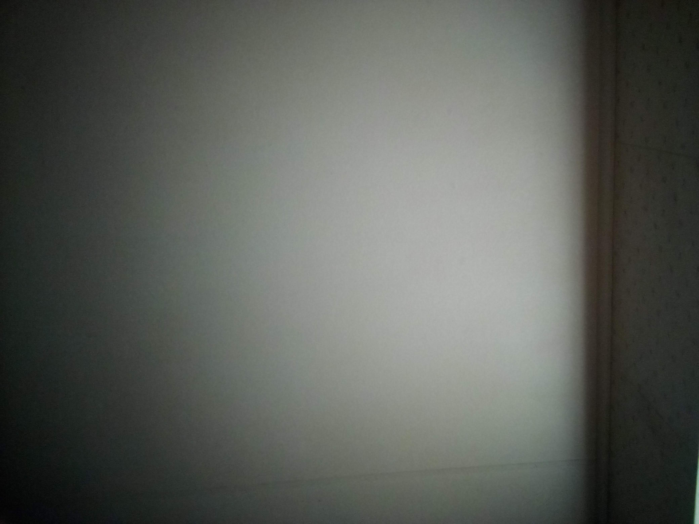
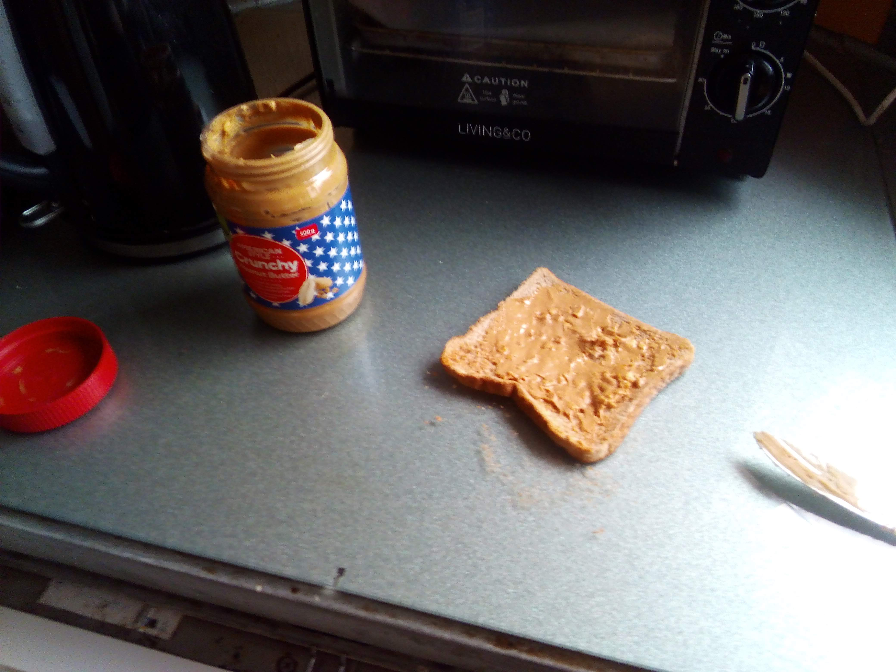
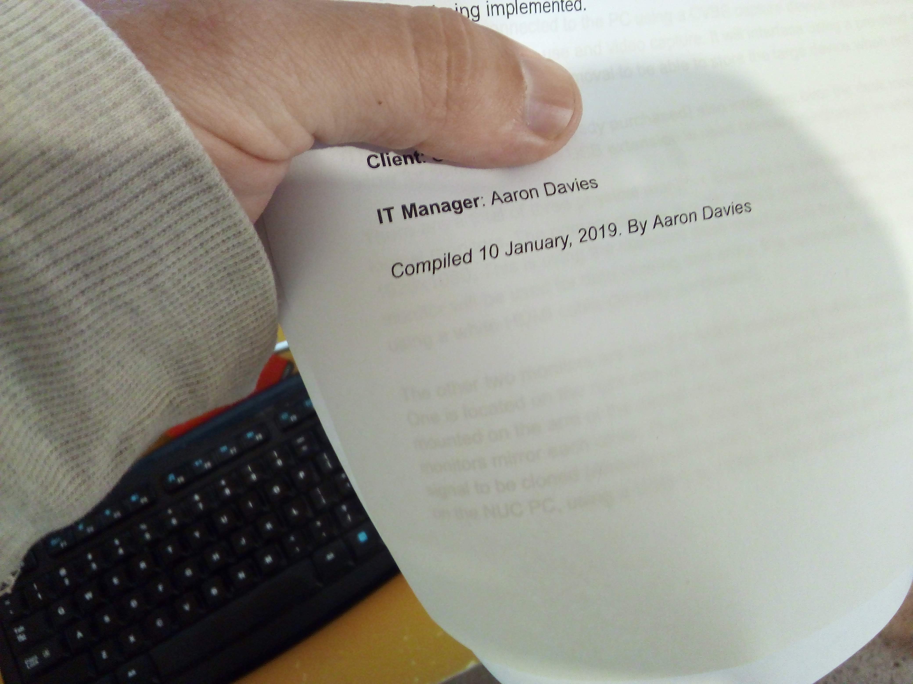
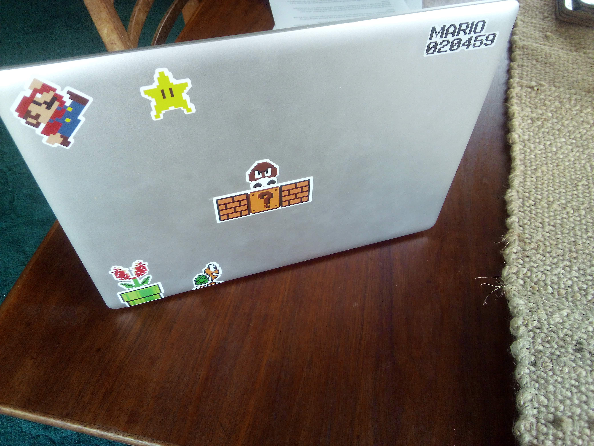
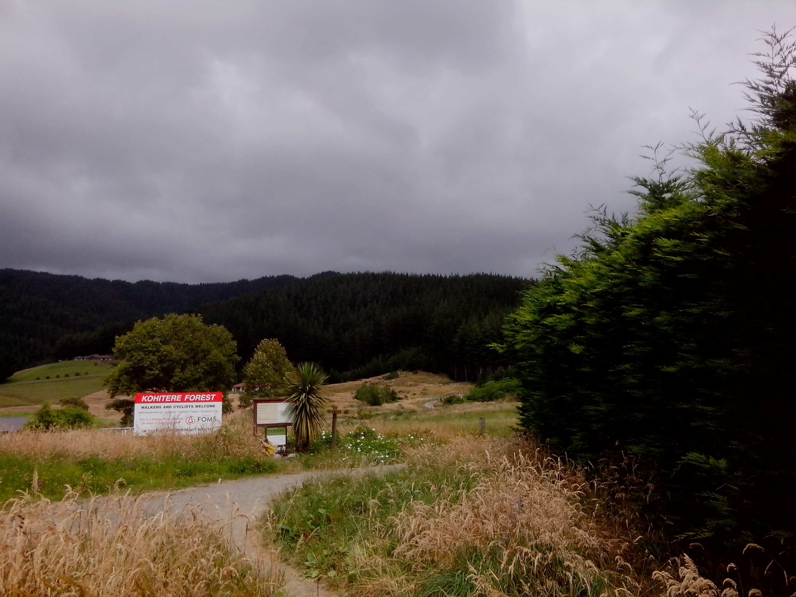
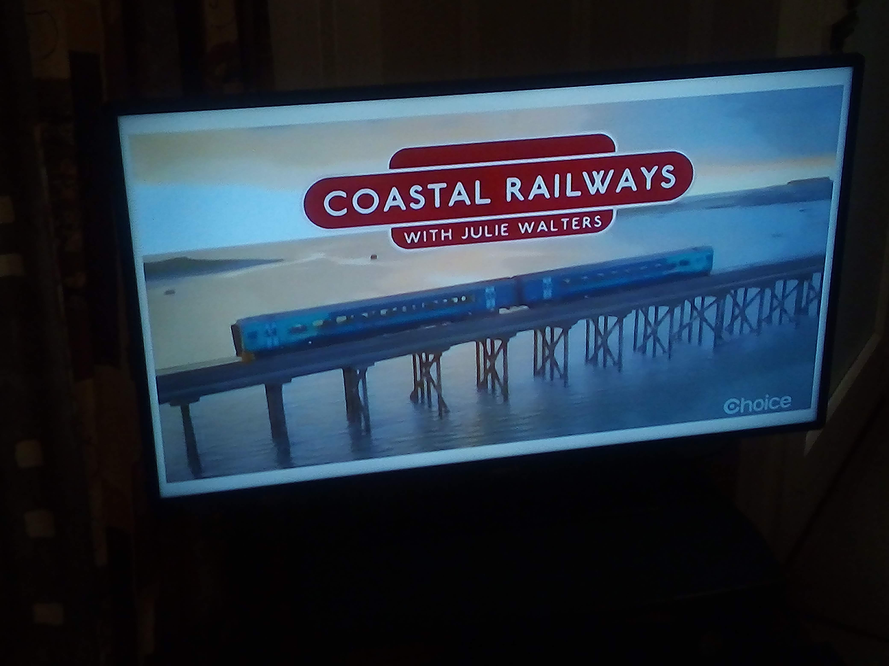

I’m just putting this together before bed. Feeling rather reflective, I’m documenting my day. It’s an archetype of my existence, being a caregiver and being this goofy human being [in small town nowhere.](https://www.google.co.nz/maps/place/Levin/data=!4m2!3m1!1s0x6d40f3627c967d4d:0x500ef6143a2d9d0?ved=2ahUKEwjP4bj2oOPfAhWGYisKHRQUCaEQ8gEwDnoECAkQCA)

Because the best way to improve things is to start with a clear and accurate understanding of the actual situation! That’s what I always say.

I’m awake at 8:30am. The first task of the day is to make sure my Dad has had his morning medication and is feeling well enough to be able to get around inside the house using his walking frame. He was good today, so it was easy enough to get him to his favourite chair.

_What an exciting ceiling._

At 9am every day my Dad gets a professional caregiver to help with his personal cleaning and grooming. It’s a huge help - it’s one of the biggest tasks and the most necessary. They also sort out his breakfast and try to help with any other tasks he might have. While that’s going on I head to my desk to check up on all the events, news and emails that pop up during the night.

After the caregiver has gone I make myself something quick to eat. I had an unfortunate errand to run - I reversed into a lamp post last month and need to drop of my car at the local panel beater. What a fun expense that is! Annoyingly, the replacement rear right light fitting hadn’t arrived on schedule.

_A toast! To being out of focus._

Unlike a few months ago, Dad is at the point where I can leave him for an hour or so during the day. It is a little bit of a risk, but if he's feeling good and a little bit mobile I’m comfortable doing it. Before he was extremely unmobile, unable to get around at all without assistance. After a stay in hospital for an infusion of some kind to strengthen the bones in his back he’s improved to the point that he often can make it to the bathroom or the fridge on his own. Having a fall is one of the biggest and scariest risks.

I’m only gone for a few minutes, and when I’m back home I get right back to my desk. I’m doing a consulting job sorting out hardware and infrastructure requirements for a new business. I finish up a document finalising the requirements and use cases. Getting these things signed and confirmed is important - proof of an agreement, in case minds get changed down the road!

_Paper! I also send faxes, sometimes a telegraph._

The biggest thing my Dad likes to do these days is to go for a ride. Getting him in and out of the car can be a tad difficult, but he gets there. I want to discuss these requirements and get them signed off in person, so I head out with him to get it done now that I have my car today. It’s only half an hour away, not too bad!

I end up staying there for way too long, both getting the hardware signed off and somehow moving on to domains and patient management systems. I get a bit frustrated, but my Dad is happy just sitting in a nice chair with a view. This client is family, and while that can lead to much greater tension it also helps with being able to bring pops along with me.

_Professional Style._

On the way back home I go into the supermarket and get some things I need. Mainly cake. That counts! Right?

When I get home it’s 3pm, and my Dad is just zonked. He has a snooze until dinner time and I sit back down to work more and totally not procrastinate.. Not at all! What gave you that idea? The tedium of the day has me feeling like I’ve been hit by a bus, too.

On weekdays my Dad gets an evening meal delivered. It’s meant to come hot, but is normally just… tepid. Before he eats I cut up the roast meat so he can swallow it with ease, then give it a good microwave zap. Pops likes his food hot! Part of his condition means eating isn’t done very fast, either.

It’s hot here in summer, so I aim to do any outdoor stuff when the sun is low. I could get up at 5am and go for a run, but that’s crazy talk! [Out the back of this small down there is a forest](https://www.horowhenua.govt.nz/Places-Events/Cycle-Tracks-Walking-Trails/Trig-Walkway), and to keep my body looking so extremely good I try to run there most days. It’s a 5 kilometer route up and down a fairly steep hill to a trig station. If Dad is up to it he likes to wait in the car and listen to his favourite old person radio station. Remember AM radio? It’s full of amplitude. Going for a run can be the last thing I feel like doing, but somehow I scrape up the motivation.

_[Sweat til you bleed.](https://www.youtube.com/watch?v=LaTGrV58wec)_

When I’m home my Dad watches the evening news as I shower my sweatiness away and make a sandwich for my dinner.

Now is when the fun begins. The evenings are by far the hardest part of any day. Getting him prepared for bed is a set of tasks. I have to sort out his Pyjamas, get him changed into them, give him his topical treatments (Yes, that’s not fun), arrange his clean clothes for the morning, give him his inhalers, get him a dessert type snack, tidy his bedroom, clean up the living areas of the house and get his teeth cleaned. Somehow, that takes over 3 hours to get done. It feels longer.

While that’s going on I try to get something to watch that both of us will find somewhat interesting. It’s…. Difficult, his attention span isn’t huge. Tonight it ended up being something about Coastal British Railways. It’s like this show read the mind of every old person in the world and generated itself from them.

_I try to like it._

After he has climbed into bed I finally get left to my own devices. I normally watch a show or play a game to chill out. Tonight it was Fallout 76 with friends! That’s…. Quite a game. I’m working on a review to put up here soon, but for now know that it’s an interesting game. Playing with friends does make it fun, though. I also spend some time watching YouTube subs. Tonight it was the latest stuff from [Digital Foundry](https://www.youtube.com/user/DigitalFoundry) and [EEVBlog - finding out about patent laws was insightful.](https://www.youtube.com/watch?v=Nes0MnoeRtg)

And then it’s past 1am. Here I am now! It’s an extremely warm night, so sleeping with the windows open and a cool breeze running through is key to success.

That is a Thursday, similar to all the rest! Being tied to this town and having my father rely on me can feel tedious and miserable at times. I do manage to get out with friends and to meet people, but it does require a bit of planning. When I meet someone I feel pathetic when I get asked what I do for a job, or where I live. Sometimes I despise my lifestyle with a violent passion.

I have to try and not let it show. If I’m feeling bad about something I don’t want my Dad to pick up on it, he doesn’t really deserve that burden.

But I’ll get there! Somehow. [The living's in the way we die.](https://www.youtube.com/watch?v=de2rBeWNgFo)

Any advice? Please, share it with me - [Twitter](https://twitter.com/aaronights), [The Facebook](https://www.facebook.com/aaronights) or [Here.](mailto:aaronights@gmail.com) Putting this post up here is a rather selfish thing to do, but it does feel beneficial. How exactly? I’m not sure. My pedantic need for documentation, maybe.

If you did read this I owe you a drink. Remind me sometime.
