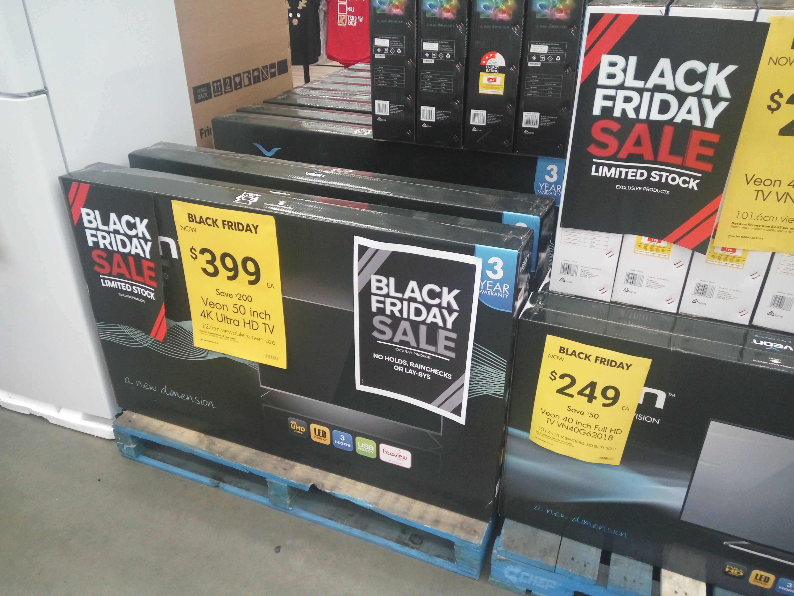
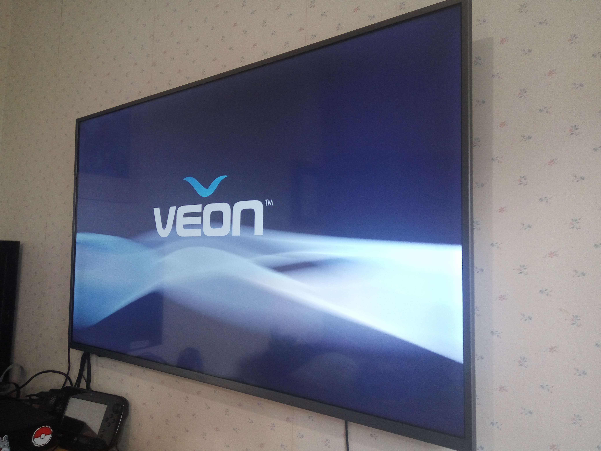
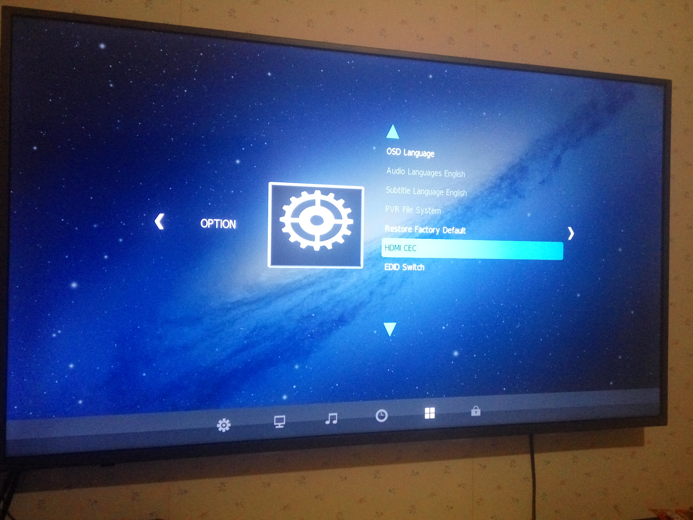
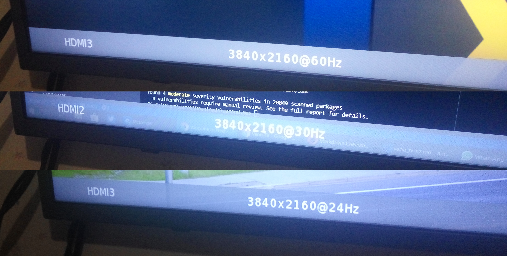
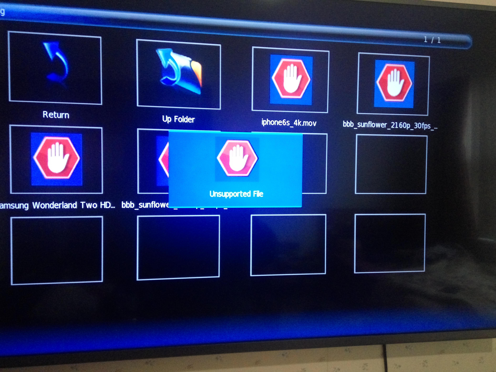
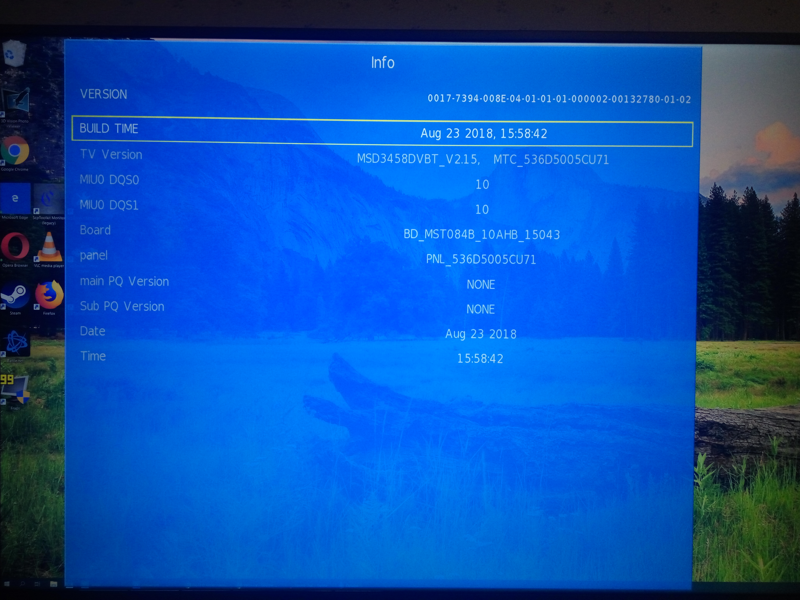

## Ultra low cost bargain?
I live in New Zealand, a rather small country with a population of just under 5 million people. This relatively small amount of consumers can lead to a lack of product variety in some areas. Out side of the known brands – Samsung to Sony, Panasonic to Philips – there isn’t much of a choice when it comes to low cost consumer electronics. There is just one exception I’m aware of to this, a store brand owned by the biggest department store chain in the country: [Veon Televisions by The Warehouse](https://www.thewarehouse.co.nz/c/electronics-gaming/tvs-accessories-/televisions#prefn1=brandCode&prefv1=Veon).

You might think that with little competition the prices might suffer, but this store brand undercuts the competition hugely. Having a Veon 4K TV cost half as much as the nearest other brand is standard, and sales and promotions can make the price gap even wider.

Is there a catch? Only one way to find out!

On Black Friday this year (one of many American traditions that was recently adopted here) a doorbusting offer was the [Flagship 50 inch 4K model] (https://www.thewarehouse.co.nz/p/veon-50-inch-4k-ultra-hd-tv/R2419177.html#sz=24&start=49) for the record low cost of $399. As of writing that exchanges to around $270 US in current rates, similar to the prices of low cost brands I see listed at Walmart and Amazon.com.  A quick look around online, the next best Black Friday deal I could find for a similar sized 4K display was a 49 inch for $718 – not quite double the cost, but nearly there.

_Extremely fancy Black Friday store display._

### Impressions
It looks fine, but nothing fancy. The bezel is nice and thin, but it goes for an imitation brushed metal look to try and spice up an all plastic frame. Unless you look close you don’t really notice, but it feels cheap when handling it.

_Thin bezel, maximum branding!_
The first time it’s turned it on you might regret your purchase. All of the default picture preset options are horrendous, with colour and sharpness pushed way over the top making most skin tones look like Donald Trump. The Sharpness setting seemed to be doing the most damage, applying a unwanted filter over the whole image. Turning that down to 0 instantly made the picture quality pop. Beyond that, tweaking to be colour accurate is fairly easy. I was able to dial in close to a pixel perfect image by changing each value independently. Depending on the room, the colour temperature setting might need changing to compensate for ambient lighting present. I’m still undecided if I prefer the Cool or Medium setting. Each setting is saved separately for each input. Using the ‘Custom’ option under Picture in the menu options, I found these settings yielded the best result:

_Tweaked to perfection._

### Functionality (No Smarts Allowed)
Without connecting anything to the video inputs, the viewing options are limited to:

* Watching Free-to-air digital TV broadcasts
* Playing video files from a USB memory stick or hard drive.

This is no Smart TV. There is no networking or app functionality at all, so Netflix or YouTube don’t get a look in. The user interface is just a few pages of generic settings, and looks right out of the mid-2000’s when digital tuners and LCD screens were a brand new thing. Even the icons in the menu look poorly compressed! Thankfully, the remote is very responsive and the few options are easy to navigate.

_Checking out the available OPTION._

Fortunately the video input options are plentiful, headlined by 3 HDMI connections that all support 4K. I was able to get the full 3840x2160 resolution working at 24hz, 30hz and 60hz. All colour signalling I could throw at it ran flawlessly, testing RGB along with 4:4:4, 4:2:2 and 4:2:0 chroma sub-sampling. There were no issues with overscan and my Nvidia graphics card could identify the TV and switched to full 4K automatically. A line in the instruction manual also states that all HDMI inputs support HDCP 2.2, so there should be no issues with copy protected content.

_Impressive with support of all refresh rates you'd ever use!_

There are also a range of legacy connections, but using that Yellow RCA composite video connector might result in an extremely distorted picture when blown up on this 8 million pixel display. If you are desperate to break out your VCR, it works good enough. The single Component video connector will work up to 1080p, but the picture is much blurrier compared to using HDMI at the same resolution.

Playback of media using the single USB port is notably limited. 1920x1080 is the maximum resolution supported, and it won’t play any x265 HEVC encoded files whatsoever. At a guess it’s the same video processor as the non-4k models, as the user interface is identical. This does mean it’s impossible to take advantage of the 4K resolution using anything except the HDMI inputs.

_Extremely unsupportive._

Connecting a 4K capable device can make this budget display sing. While it doesn’t support any HDR modes, it looks great when displaying a standard colour range image. It’s definitely not an OLED competitor, but the blacks are black enough and the vibrancy of colours looks fantastic to my admittedly untrained eye. It easily competes with anything close to its price range; I’d be willing to put a well configured unit head to head with brand names costing over twice as much. 

A great but not well known feature in modern televisions is the CEC, or Consumer Electronics Control, protocol. This allows you to use the remote of a Television to control devices connected over HDMI. This Veon model supports the full CEC standard, allowing control of both the TV plus most media boxes, Blu-Ray players and streaming sticks all from the one remote control that is included in the box. It’s incredibly useful - using one remote to do everything! Not having to juggle through four or five just to figure out what one turns the volume down. In some ways this can compensate for the lack of Smart TV integration as it makes using an attached smart device a very seamless experience.

Using an external sound system is worthwhile, as the included stereo speakers don’t cut the mustard for anything but basic dialog. Fittingly, there are digital and analogue audio outputs plus support for Audio Return Channel on one of the HDMI inputs.
### Secrets
Most TVs, brand names included, have hidden menu options used by the factory for calibration and hardware testing. Some are blocked from being accessed when they’re sent to the retailer, but this budget model does no such thing. It is found by pressing Source, 2, 5, 8 and 0 in sequence, giving you access to a huge number of options to tweak the TV including:
* Lower the backlight level - a feature often found in high end displays.
* Change the picture and audio presets.
* Disable or enable film processing for things like 3:2 pulldown.
* Change the analogue TV tuner from PAL to SECAM (In case you want to watch broadcast TV in 1999 France).
* Flip the image upside down.
* Adjust the volume level curve
* Enable and customise the amount of overscan (It’s set to off by default, thankfully).
* Display various test patterns to check the integrity of the LCD panel.
* Show information about software and hardware. My unit had a software build date of August 23, 2018, just a few months before I purchased it!

_Details for nerds._

My personal preference was to lower the backlight level down to 75 from 100, but if you are viewing the TV from farther away you might want to keep it much higher. Accessing a test pattern under Factory Setting > Other is an ideal way to test the configuration around each colour. It might not be an advertised feature, but this hidden menu allows for tweaking and adjusting of every little detail. Be careful – some settings might make it very difficult to recover, like turning the backlight off entirely or maxing out some obscure dithering option.

### Deal or No Deal?
Basic, pure and simple TV’s like this are a dying breed. Even most economy models come with crude Internet connectivity for video streaming. It’s unfortunate! For some use scenarios an integrated media streaming solution just won’t be wanted. Partnering this TV with a Xbox One X, Playstation 4 Pro, Chromecast Ultra or any number of 4k streaming boxes not only gives a fantastic viewing experience, but is probably a far better user experience than what a budget Smart TV could offer. Plus you’re not dependant on the manufacturer firmware updates for compatibility and security in the ever changing digital media landscape.

It’s unfortunate that fairly extensive calibration is needed to get a good viewing experience. At this super low cost the average consumer would probably be the target market, yet to get a good result you need the skill set closer to that of an enthusiast.

_Budget TV meets All Mighty Hedgehog - Perfect Match!_

This TV isn’t high end, but it doesn’t claim to be. While it does have its fair share of issues, the picture quality once it is well calibrated isn’t one of them. If you want an all in one media solution or inky blacks running in High Dynamic Range this has to be a hard pass, but if you want something cheap that looks great when running at full 4K from an HDMI device? This is the best deal available in the country.

*Have any questions about this review? Buzz me on Twitter [@aaronights](https://twitter.com/aaronights) or email [aaronights@gmail.com](mailto:aaronights@gmail.com).*